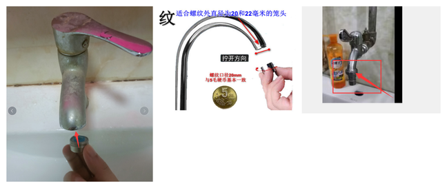
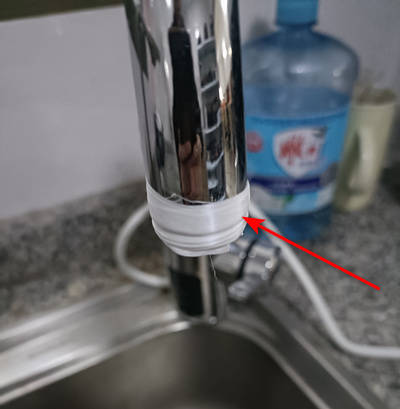
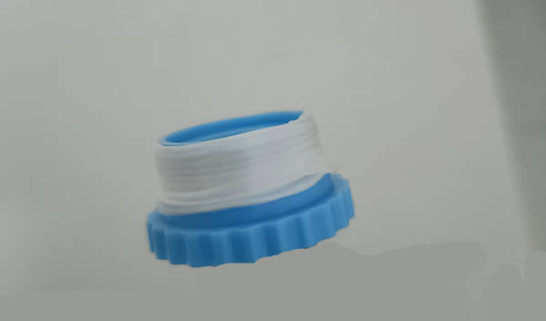
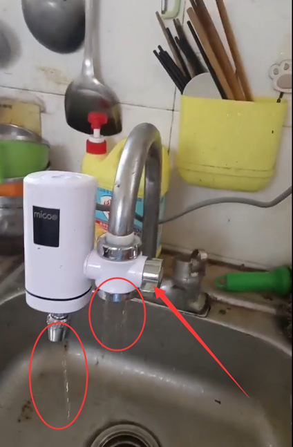

# 免安装款售后问题

## 一. 漏水问题

### 1. 万能接头漏水处理
在售后环境中,万能接头漏水问题<sapn class="marker-text-highlight">比较常见</sapn>,以下是一些解决方法:
* 检查起泡器
    * **若顾客的弯管或笼头配有起泡器,建议拆除后使用有螺纹的安装方式。** `如下图`


* 补贴方案
    * **如果没有起泡器,可为顾客提供10元补贴,以更换为带螺纹的新笼头以解决安装问题**

* 退货方案
    * **万能接头的适配性有限,特别是在大口径和高水压情况下更易发生漏水。如顾客要求退货,请做好劝留并原因引导或主动发起售后服务。**

* 短语参考
```c#
1.亲,百分之99的笼头都是有起泡器可以拆下来,使用螺纹安装呢,您拍下您的笼头这边帮您看下。
2.亲,您的龙头确实没有螺纹,您看这边给您申请10元的补贴,您这边换个带螺纹的新笼头安装,您看可以吗？
3.实在抱歉呢亲,万能接头适用于21毫米以下口径的龙头,口径较大,可能会出现漏水的情况呢,无法适配安装呢
```
***

### 2. 接头配件漏水处理
接头配件漏水少见的,而且漏水量教少,一般多裹点生料带是可以解决的.
* 外螺纹生料带使用
    * **外螺纹的笼头,生料带需要裹在龙头的外螺纹上**


* 内螺纹生料带使用
    * **内螺纹的笼头,生料带裹在接头配件的外螺纹上。**


* 补贴补发方案
    * **如果还是不能解决的话,可以补发接头配件解决,或者协商补偿解决**

*  短语参考
```c#
亲,水龙头安装后配件与水管连接的地方,还是会有部分细微空隙,
可使用生胶带缠住水管和配件连接处,可解决大部分使用时接口漏水问题哦！
```

> [!IMPORTANT]
> 如果顾客明显表示生料带无法解决,或者不想弄 <br>
> 及时提供补发、补偿方案,尽量协商一致,若顾客情绪过激,需要退款做好劝留+引导动作
***
### 3. 冷热水出水口一起漏水
当顾客发送相关的图片和视频显示,两边出水口一起在出水,要注意阀门的情况`如下图`


* 关水
    * **如果顾客的阀门打到中间,则顾客是想关水,免安装是不具备关水功能的**
* 漏水
    * **当阀门打满以后,另外一边还漏水则是故障了,补发分水器即可解决。**
*  短语参考

```c#
1.亲,免安装款是不具备关水功能的呢,关水将热水器打到冷水,然后关闭家里的水源即可。
2.亲,您将手柄的热水区打满还会漏水吗,麻烦拍视频这边帮您看下
```

> [!IMPORTANT]
> 如果打满冷水还漏水就补发分水器 ,情绪过激的顾客可进行换货处理<br>
***
### 4. 不加热 & 不通电
遇到免安装不加热/不通电的情况,你需要注意一下事项：

* 检查原因
    1. 顾客操作是否存在问题,热水器有没打到热水区
    2. 机器通电和加热与水压有关,需要检查水压情况
    3. 需要检查漏保接线情况,和是否烧坏（漏保灯亮不代表接线正确,也不代表没有烧坏）

* 短语参考

```c#
1.亲,为了核实您的问题,需要麻烦您配合我们排查一下问题的原因,以便能更快的帮助您解决
2.亲,您这边通电打到热水,然后堵住出水口3-5秒,拍下视频,机器是否会亮起呢？
3.抱歉呢亲,您这边把插头接线情况拍照我帮您看下,是否有烧坏或者接线问题,这边一定为您妥善处理,请您放心.
```

> [!IMPORTANT]
> 如果堵住出水口机器会亮起，说明是顾客家里的水压太低了,机器无法启动.<br>
> 接线错误，或者漏保烧了也是无法启动的。<br>
> 如果检查水压和接线都没有问题的话，应是机器故障，及时协商给予换货处理。