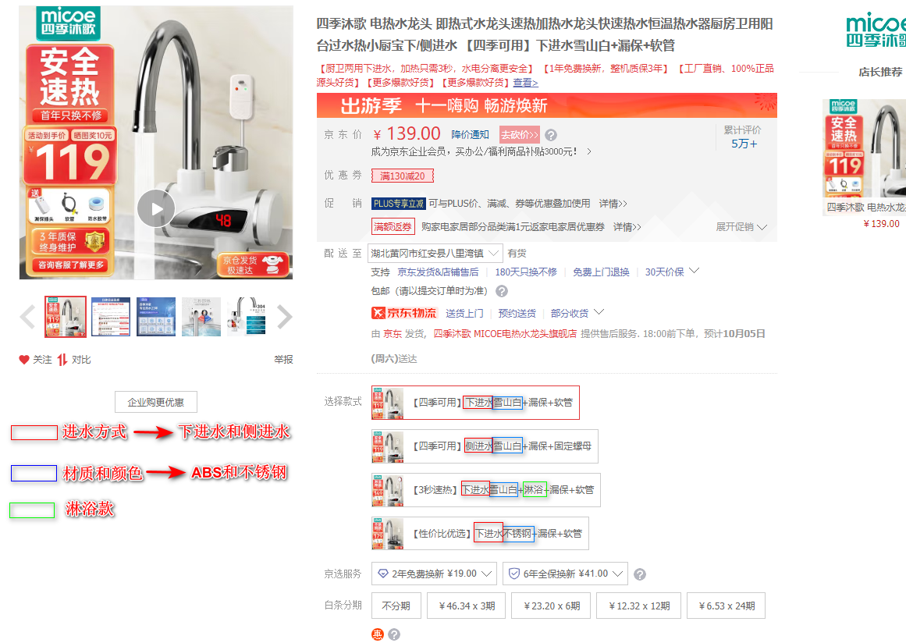
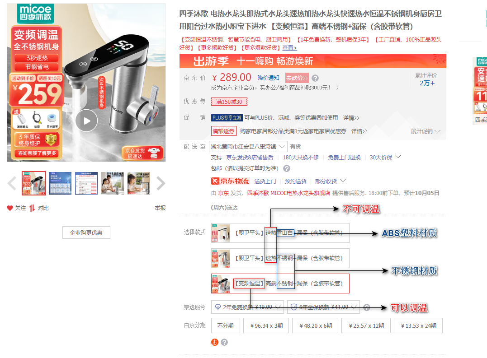
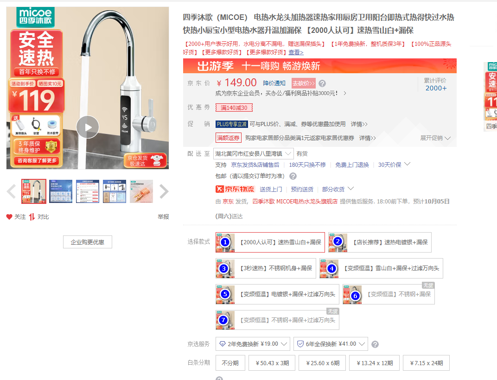

## 选项卡区别
链接1：https://item.jd.com/37068829320.html

链接2：https://item.jd.com/57520536234.html

链接3：https://item.jd.com/10082665937921.html#crumb-wrap

<!-- ### 1. 上图中1号选的进水方式是什么？是什么材质？可不可以调温？

### 2. 上图中2号选的进水方式是什么？是什么材质？可不可以调温？

### 3. 上图中3号选的进水方式是什么？是什么材质？可不可以调温？

### 4. 上图中4号选的进水方式是什么？是什么材质？可不可以调温？

### 5. 上图中5号选的进水方式是什么？是什么材质？可不可以调温？

### 6. 上图中6号选的进水方式是什么？是什么材质？可不可以调温？

### 7. 上图中7号选的进水方式是什么？是什么材质？可不可以调温？ -->
