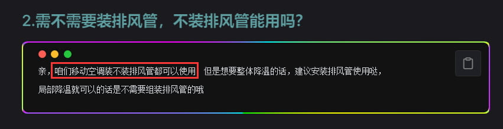
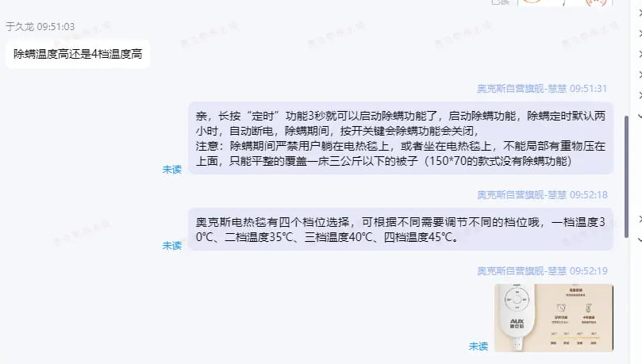

# 售前核心 > 将产品卖出去
<ArticleMetadata />
::: tip 课程目标
* 精准回复的重要性<br>
* 催付结构、催付时机<br>
* 邀评场景、邀评时机<br>
:::


## 一、思考顾客的想法！

现在让我们对客户行为进行分析,当我们为顾客的时候,**我们希望得到什么样的服务** ？

1. **快速精准的解答**
   - 在咨询时，我们希望能得到关于功率、尺寸等信息的快速、准确回复。
---
2. **优惠的价格**
   - 顾客通常希望以更优惠的价格购买产品。
---
3. **快速的交付**
   - 顾客希望能在最短时间内收到产品，最好能够优先发货。
---
4. **良好的售后服务**
   ---- 顾客期待有足够长的质保和质量保障，以防止损失。

5. **专业的客服**
   - 希望客服能迅速回复问题，且态度耐心热情。
---
> [!IMPORTANT] 综上所述：
> 1. 顾客在咨询时常有疑问，需得到`明确解答`。
> 2. 顾客希望以`优惠价格`获得优质服务，包括`质保`、`快递`、`回复效率`及`服务态度`等...。


---

## 二、认识售前流程的结构
> [!NOTE] 信息
> 根据顾客的需求，制定相应的售前流程，以解决他们的问题。
---


---

## 三、精准回复

### **1.** 什么是精准回复？
在顾客提问时，需要做到以下几点：

*  **正面回答**：直接回答顾客的问题，避免回避。
*  **准确性**：提问涉及到`是`、`否`,`可以`,`不可以` 等、有明确答案时，第一句应当尽量简短,或`术语十分清晰`
*  **易懂清晰**：回答需直接，回到要点上。

---
### **2.** 精准回复的重要性？
::: warning 重要
顾客的提问映射---> 顾客对`产品的需求` <br>
如果顾客的`核心需求`没有解决,那么顾客的购买意愿就会降低.
:::
---

### **3.** 回复案例
:::tip 正确案例
下图中,顾客问题得到`精准回复`和`明确答案`，且附有`建议`，属于正确案例。

:::
---

:::danger 错误案例
下图中,顾客提问未得到`正面回复`，导致`疑虑未消`，属于`错误案例`。

:::

##### 在遇到上述情况时,我们可以明确告知顾客答案:**除螨的温度高**、再配合短语介绍一下 4 个档的温度
`回复参考`

```c#
1.亲，除螨的温度更高呢，大概在50度左右          -->精准回复,答案明了准确
2.奥克斯电热毯有四个档位可以选择，可根据需要选择不同的档位一档温度30℃、二档温度35℃、三档温度40℃、四档温度45℃。 -->详细信息
```

---
### **4.** 小故事
::: details 小故事阶段一
:::danger 反面案例
 小丽是一名新上任的家具店员。<br><br>
 在她第一天上班时，老板提醒她：“顾客来店里时，一定要热情接待，并告诉他们我们的产品信息，包括我们的质量保障政策：15天内如有质量问题可以退货，我们在质保期内还提供上门维修服务。”<br><br>

第二天，小明走进店铺，想要购买沙发。他询问小丽：“你们这款蓝色沙发的长度是多少？”他补充道：“我家的客厅只能放下3.5米以内的沙发，如果超过这个长度就放不下了。”
<br><br>
然而，小丽只回复：“我们家的沙发如果不喜欢可以退，还提供上门维修服务。<br>

”由于小丽忽视小明的问题，`导致他感到无法沟通`，最终选择离开了店铺，转向了隔壁的店铺进行咨询。
:::


::: details 小故事阶段二
:::tip 正面案例
小明随即来到隔壁店铺，看到一款皮质沙发。对店员小花`提出了同样的问题`”

小花微笑着回答：“这款沙发的长度大约是3.3米，`正好适合您的空间`。  

”她继续介绍：“现在店铺正在进行`促销活动`，购买这款沙发还可以`免费获赠沙发套`，并`享受9折优惠`。另外，我们还提供`上门安装服务`，`连续三年每年都有一次免费的上门护理服务`。”

小花进一步补充道：“如果您再购买茶几，我们可以将`折扣升级为85折`，并赠送一些`小凳子作为额外礼品`。”

小明在这里得到了`准确的购物信息`以及店员提供的`丰厚优惠`和`优质服务`，最终决定在这家店铺下单购买。

:::
---

### **5.** 需求映射-->顾客提问的重要性！
::: details 举例1
顾客：需求,买一个水杯，希望手能够塞进去，方便清洗<br>
潜在提问：这个水杯可以塞手进去吗？  尺寸是多少？
:::

::: details 举例2
顾客：需求,买一个蒸锅，希望能蒸鱼，并且蒸包子的时候，不会湿哒哒的<br>
潜在提问：这个蒸锅可以蒸鱼吗？  尺寸是多少？   蒸包子会有水汽湿哒哒的吗？
:::

::: details 举例3
顾客：需求,买一个电热毯，急用希望快点发货，并且希望小宝宝那边可以不加热？<br>
潜在提问：什么时候发货？ 发什么快递？  可以单边开启吗？
:::


---

## 三、催付

### **1.** 什么是催付？
在顾客的提问解决以后，我们需要主动向顾客推送一些重要的信息，来引导顾客下单.催付的结构一般为：<br>
<font title="red">卖点</font>、<font title="red">优惠</font>、<font title="red">保价</font>、<font title="red">运费险</font>、<font title="red">质保</font>、<font title="red">主动挖掘</font>、等....
---
### **2.** 催付的结构是什么？
以移动空调为例：

::: code-group

```c# [卖点]
亲，咱们实测出风口制冷温度，大2p可以达到8度左右，1.5p可以达到10度左右，1p可以达到15度左右，效果非常好哒，喜欢可以拍下哦
```

```c# [优惠]
亲亲,我们限时活动冲销量喔，现在下单给您申请最大福利 1.5P（2P）嗮图一起帮您优惠 120 元哦
```

```c# [保价]
任何平台比我们便宜，有截图，我们全部在它的基础上再优惠 20咱们家就是最优惠的价格，可以放心下单，无忧购买
```

```c# [运费险]
亲可以放心购买试试看哈，我们有赠送大额运费 险，收到货不合适不满意支持七天无理由退换货的，
来回运费我们承担的哦，好的产品质量才敢如此保证的呢
```

```c# [质保]
我们支持全国联保，1 年换新，365 天整机质保，保障期内质量问题来回运费，维修费用全包，售后无忧，放心购买喔！~

```

```c# [主动挖掘]
亲,您还有什么疑问或者顾虑吗？或者您对产品有什么需求和想法都可以告诉客服这边随时为您解答呢！
```

```c# [试一试]
亲亲，我们是支持7天无理由退换，如果收到不满意、不喜欢、不想要都可以退换，可以买回去体验一下呢，相信您会满意的喔！
```

:::

---

### **3.** 什么时候进行催付？-->催付时机

当顾客在使用手机进行搜索商品时，往往会咨询很多的客服，询问多款候选产品进行对比咨询
所以顾客在提问后，在店铺的停留时间，`一般不会超过 30 秒`

顾客同时咨询多家店铺，多个客服，为什么在你这里下单购买？ `Why is it you`

```c#
1.专业精准的回复：我们能够迅速且准确地解决顾客的问题。
2.价格优势：提供全网最低价，支持比价，确保顾客获得实惠。
3.超长质保：我们的产品享有超长质保，可以轻松更换，且质量问题的运费我们承担。
4.运费险保障：我们提供运费险，让顾客无忧购物，降低购买风险。
5.主动挖掘：我们热情主动，深入了解顾客的顾虑，提供个性化的解决方案。
6.发货效率：我们发顺风、或者京东、确保商品快速到达顾客手中。
....
"通过推送附加价值，您将能有效提升顾客的购买意愿，从而实现成交！(具体根据产品的营销策略来推送附加服务)"

```

## 四、售前邀评
### **1.** 什么是邀评和满意度？
邀评是指`客服`端向顾客发送邀请,对`客服服务`进行`打分`,星级为1-5星.<br>
分别对应: **非常不满意、满意、一般、满意、非常满意**<br>
其中`1-3星皆判定为差评`.

$$ 满意度 = {非常满意人数 +\ 满意人数 \over 总评价人数} $$

#### **1.1** 满意度计算方式
* 例一：
好评人数为95，评价总人数为100，则满意度为：
$$ 满意度 = {95 \over 100} = 95\%  合格$$

* 例二：
好评人数为88，评价总人数为100，则满意度为：
$$ 满意度 = {88 \over 100} = 88\%  不合格$$

---
### **2.** 邀评的对象人群是什么？
* `售前邀评对象推荐为`

    * 刚下单的顾客
    * 沟通后表示感谢的顾客
    * 领取红包的顾客
    * 对客服表示认可的时刻
    * 其他顾客表示满意的场景
---

### **3.** 邀评的时机是什么？
* 邀评的时机一般为`上述场景`发生后的`几秒内`进行邀评,获得`概率会比较高`！
* 顾客`下线以后`,`概率几乎为0`

---


>[!NOTE] 总结
当顾客进行咨询时,`精准回复至关重要`,这很大程度的决定了产品是否满足的顾客的需求<br>
其次就是主动推送产品的`附加价值`、优惠、质保等....,引导顾客下单，主动挖掘顾客疑问和顾虑。<br>
<br>
我们需要在`精准回复`顾客的问题后,马上进行`催付`,引导顾客下单购买
<br><br>
同时,在顾客下单或表达满意时,及时进行邀评,以提升客户满意度。
