### 仓库异常处理全流程
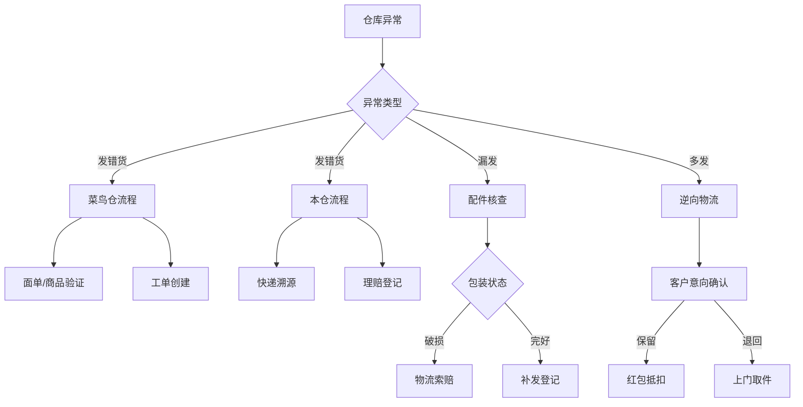

### 5.1 错发处理SOP
#### ▌菜鸟仓错发（智能工单系统）

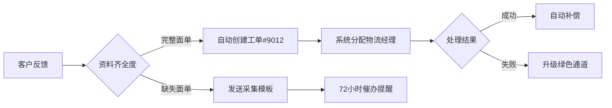

#### ▌本仓错发（人工干预流程）

![[紧急联络矩阵.png|200x300]]

1. 登录「快递溯源系统」输入单号
2. 比对揽收时间戳与打包录像
3. 触发三级处理机制：
   - 一级：当日16点前反馈 → 2h响应
   - 二级：当日16点后反馈 → 次日10点响应
   - 三级：节假日报备 → 48h紧急通道

   
<SecureAccess level="3"> ```json { "退货地址": "上海市普陀区祁连山南路2891弄200号康鹏生命科技产业园3幢12楼", "紧急联系人": { "工作日": "王经理 153-7887-1451", "节假日": "应急值班 021-5659-8873" }, "系统权限": "需申请SCM_Level2权限" } ``` </SecureAccess>

#### 5.2 漏发处理决策矩阵
证据类型	处理方式	补偿标准	完成时限
完整面单+69码	自动触发补发	赠品补偿	≤24小时
仅面单	人工核查	5元抵扣	48小时
无凭证	登记待查	3元心意红包	72小时
❗ 红线规则：

月累计漏发3次以上客户自动标记为VIP

同SKU周漏发超5单触发库存预警

重大节庆期间启用双倍补偿策略

5.3 多发货品智能回收系统
mermaid
复制
sequenceDiagram
    客户->>+系统: 反馈多收商品
    系统->>+WMS: 校验发货记录
    WMS-->>-系统: 返回装箱录像
    系统->>+客服: 推送比对结果
    客服->>+客户: 发送回收协议
    客户->>+物流: 扫码预约取件
    物流-->>-系统: 回传签收凭证
    系统->>+财务: 触发到账提醒
话术智能生成器：

python
复制
def generate_recovery_message(scenario):
    templates = {
        'keep': "感谢您选择保留商品，系统已为您生成专属抵扣码【KEEP2023】，下次购物可直接使用~",
        'return': "已为您预约【{date} {time}】时段上门取件，取件码：{code}，取件后72小时原路返款",
        'delay': "因物流高峰影响，您可保留商品至{date}前，期间随时可扫码申请取件"
    }
    return templates.get(scenario, "感谢反馈，专员将在10分钟内联系您")
5.4 应急处理通道
▌黄金4小时响应机制

markdown
复制
[](http://example.com)

1. 重大客诉触发「红色预警」时：
   - 自动解锁优先处理权限
   - 发起三方通话（客户+仓库+物流）
   - 生成应急处理ID追踪

2. 夜间/节假日模式：
   - 启用AI预处理机器人
   - 值班主管15分钟响应
   - 预授权200元赔付权限
▌数据驾驶舱（实时监控）

vega
复制
{
  "$schema": "https://vega.github.io/schema/vega-lite/v5.json",
  "data": {"url": "data/warehouse_issues.json"},
  "mark": "bar",
  "encoding": {
    "x": {"field": "hour", "type": "ordinal"},
    "y": {"aggregate": "count", "type": "quantitative"},
    "color": {"field": "issue_type", "type": "nominal"}
  }
}
优化亮点：
智能分级：建立异常级别自动判定规则

风险防控：增加红色预警机制和赔付权限控制

数据驱动：接入实时监控数据看板

权限隔离：敏感信息采用权限分级查看

流程闭环：每个环节增加完成度校验

知识关联：嵌入系统操作截图和视频指引

是否需要补充应急预案的详细演练步骤？或添加各快递公司的特殊处理协议？


## 一、关于发货
### 本仓缺货处理流程
#### 发货超48小时标准处理方案
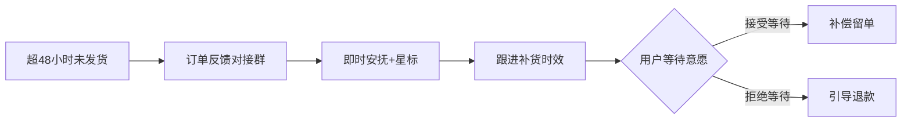
---

#### 操作三部曲
1️⃣异常报备
执行动作：
- 订单号同步至【厨电后台售前售后-对接群】
- 备注标记红星

2️⃣即时安抚
``` c#
亲爱的,您的订单发货异常,这边已经紧急反馈,将在24小时内给您明确答复🌹
```

3️⃣协商处理
::: code-group
``` c# [告知发货时间]
非常抱歉让您久等，因仓库调拨需要额外[XX工作日]，我们特别为您申请了延误补贴5元,
如您同意,我们将在xx日为您安排发货~
```

```c# [不愿意等待]
理解您的时间宝贵！我们将立即为您办理退款,您在后台申请仅退款这边第一时间为您处理,
给您带来不便真的非常抱歉！
```

```c# [情绪异常]
十分抱歉,为了表示歉意,我们按照平台延时发货赔付给您5%的订单金额,最低5元,最高50元.请您消消气.
```
:::

---

### 菜鸟仓缺货处理流程
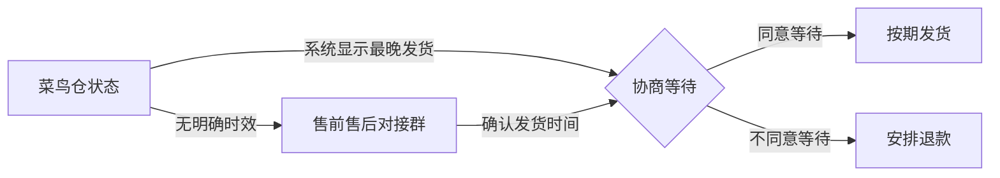

> `处理方案及术语与本仓缺货处理流程相同`

---
## 二、关于发票
### 1.发票申请方式
::: code-group
``` c# [自行申请]
亲,需要开票的话,找到您的订单,申请开票即可哦~
``` 

``` c# [不愿意自己申请]
亲,您这边不方便申请的话，麻烦提供下开票信息,这边为您登记开出呢.(强烈建议您在后台申请会快很多喔！)
``` 
:::

### 2.修改发票
::: code-group
``` c# [自行修改]
亲,需要修改开票的话,找到您的订单,在订单申请即可呢~
``` 

``` c# [不愿意自己修改]
亲,您这边不方便申请的话，麻烦提供下开票信息,这边为您登记修改呢.(强烈建议您在后台申请会快很多喔！)
``` 
:::

### 3.发票修改时效
- 修改发票抬头订单期限为一年内订单可修改

### 4.班牛登记发票方法

<video src="./video/发票登记.mp4" controls="controls"></video>

---

## 三、关于物流
### 1.外包装破损
- 向顾客索要包装箱（面单面、69码面）、产品照-->班牛`物流问题投诉`

#### 图片示例
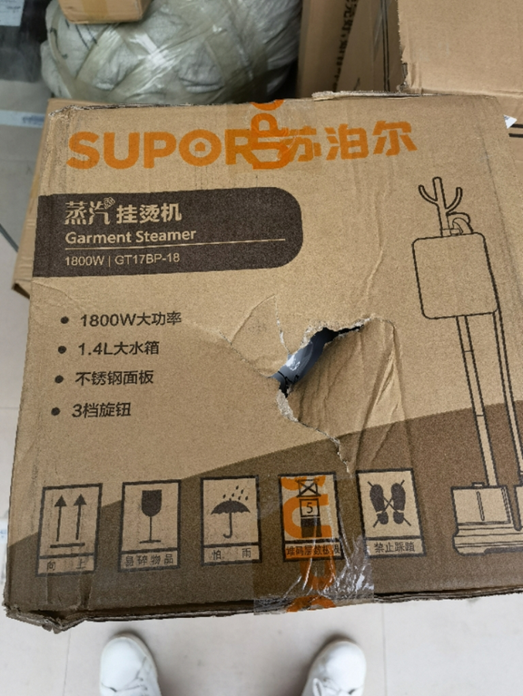
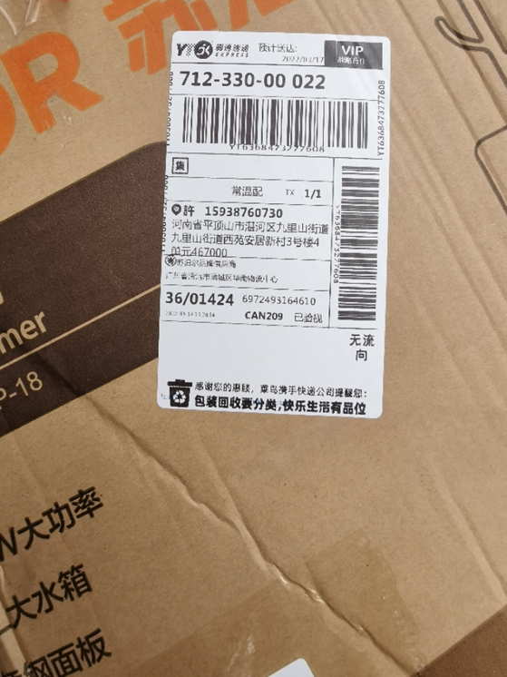

#### 物流投诉登记视频

<video src="./video/物流投诉.mp4" controls="controls"></video>

---

### 2.如何识别本仓和菜鸟仓
PPT和表格不一致


### 3.菜鸟账号
- 账号：苏泊尔品牌供应商:厨旗小艺
- 密码：cq18110697120
- 链接https://scp.tmall.com/?frameUrl=https%3A%2F%2Fscp.tmall.com%2Fpages%2Fsdigit%2Ffulfillment_order_manage#381051.381053.381252

### 4.物流长时间不更新
规则混乱无法识别

### 5.丢件处理
规则混乱无法识别


### 四、关于配件
配件缺货流程含糊不清


### 五、关于仓库问题
#### 1.菜鸟仓发错货
1.索要面单（清晰可见）
``` C#  
亲亲,麻烦您提供下快递面单，辛苦您拍摄清晰,这边帮您反馈一下.
```
2.创建服务单


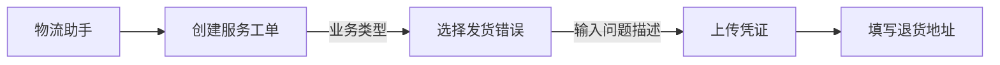

```
退货地址：上海市普陀区祁连山南路2891弄200号康鹏生命科技产业园3幢12楼
15378871451苏泊尔厨旗售后部
```
---

##### 本仓发错货
1. 查看快递揽收地址
2. 发对应快递群反馈
3. 登记班牛`班牛本仓发货快递丢件破损错发理赔登记`


#### 2.漏发
1. 索要面单、69码、产品照(需要清晰可见)
2. 包装破损导致配件丢失，按外包装破损处理
3. 包装完好、配件漏发
- 创建班牛工单-->配件需求登记

#### 3.多发和退款后收到商品
1. 询问顾客是否还需要商品
2. 需要则通过旺旺发红包到店铺即可
3. 不需要反馈QQ群【厨旗后台售后售前-对接群】安排顺丰上门取回货物

```
订单号:xxx
地址电话:xxx
顾客反馈【多发/退款后收到商品】,请安排上门取回！
```

## 五、页面问题
### 1.页面问题分类
1. 详情、主图有误
2. 价格有误
3. 产品参数有误

### 2.处理方案
1. 确认顾客诉求
2. 补偿额度内，订单上申请补偿款，打好备注,同步反馈到@客服主管
3. 补偿额度外，顾客诉求反馈至@客服主管

> 所有消费者反馈页面问题全部：微信苏泊尔厨旗售后疑难问题沟通群@客服主管

## 六、价格问题
### 1.保价规则
1. 商品默认保价30天(有特殊约定以页面为准)
2. 保价优先发送保价卡片处理退差
3. 保价标准为:顾客提交新订单我方的实收价格差异,非顾客支付价格

### 1.保价
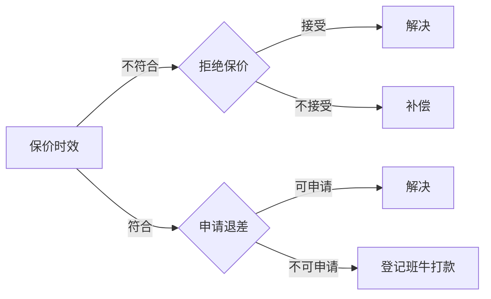
`班牛打款时效为72小时内`

---

### 2.直播差价
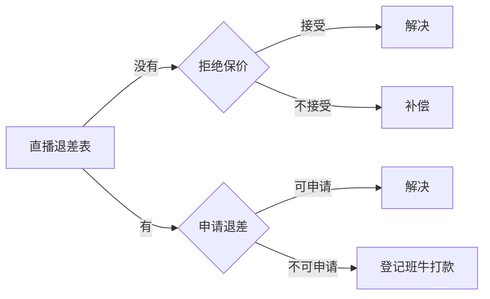

---

### 3.活动差价
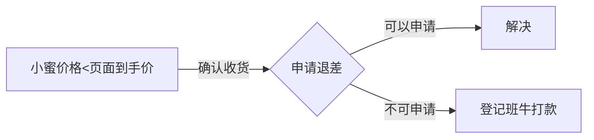

---


### 4.团购退差

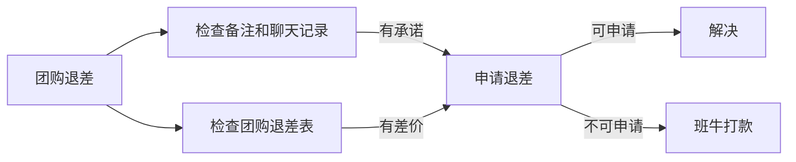


## 七、回复错误


## 八、产品问题
### 1.售后方案
1. 补偿
2. 补发
3. 线下送修
4. 公众号寄修
5. 派单寄修
6. 换货 (收货<15日或者有x年换新的商品)
7. 退货(收货<15日)

> 售后方案按优先级排序

### 1.质量问题处理流程
1. 核实产品问题
```
麻烦您拍摄一下商品存在的问题,这边会尽快为您解决,请您放心!
```
2. 判断商品是否为质量问题或使用问题
- 使用问题-->引导正确使用即可
- 质量问题
    - 进一步区分产品是否影响使用
3. 分级处理
- 不影响使用
    - 优先补偿或补发 (最高不超过10%，额度5-50元,50以上需要反馈申请)  -->登记班牛售后咨询分类
    - 送修 (查询顾客就近地区送修)
    - 公众号寄修 (我们承担运费)
    - 派单寄修(需要登记班牛派单寄修)
    - 换货 (收货<15日或者有x年换新的商品)
    - 退货(收货<15日)
- 影响使用
    - 送修 (查询顾客就近地区送修)
    - 公众号寄修 (我们承担运费)
    - 派单寄修 (需要登记班牛派单寄修)
    - 换货 (收货<15日或者有x年换新的商品)
    - 退货(收货<15日)

> 注意售后问题都需要登记班牛 售后咨询分类

## 九、退款问题


## 十、特殊商品换新

## 十一、补充说明


<!-- classDef condition fill:#f0f4c3,stroke:#8bc34a;
classDef action fill:#bbdefb,stroke:#2196f3;
class B,E,I condition
class C,D,F,G,H,J,K action -->

