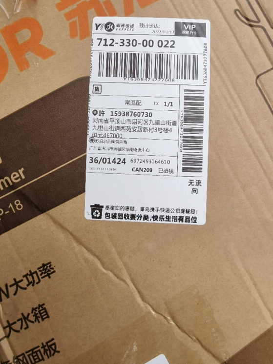

# 苏泊尔售后指南
## 一、关于发货
### 本仓缺货处理流程
#### 发货超48小时标准处理方案

---

#### 操作三部曲
1️⃣异常报备
执行动作：
- 订单号发送至【厨电后台售前售后-对接群】
- 备注记载顾客问题,标记红星跟进

2️⃣及时安抚
``` c#
亲爱的,您的订单发货异常,这边已经紧急反馈,将在24小时内给您明确答复🌹
```

3️⃣协商处理
::: code-group
``` c# [告知发货时间]
非常抱歉让您久等，因仓库调拨需要额外[XX工作日]，我们特别为您申请了延误补贴5元,
如您同意,我们将在xx日为您安排发货~
```

```c# [不愿意等待]
理解您的时间宝贵！我们将立即为您办理退款,您在后台申请仅退款这边第一时间为您处理,
给您带来不便真的非常抱歉！
```

```c# [情绪异常]
十分抱歉,为了表示歉意,我们按照平台延时发货赔付给您5%的订单金额,最低5元,最高50元.请您消消气.
```
:::

---

## 二、关于发票
### 2.1 发票管理

| 业务场景        |      自助方案(推荐)      |  人工方案 |时效参考|
| ------------- | :-----------: | ----: |----: |
| 发票申请      | 订单页开票 | 班牛登记开票 |T+3工作日|
| 发票修改      |   订单页修改    |   班牛登记修改 |T+5工作日|

### 2.2操作指引：
- 优先引导自助办理
- 人工处理需登记班牛（登记方法见下面视频）
- 修改时效：一年内订单可修改
---

### 2.3 开票短语参考
::: code-group
``` c# [自行申请]
亲,需要开票的话,找到您的订单,申请开票即可哦~
``` 

``` c# [不愿意自己申请]
亲,您这边不方便申请的话，麻烦提供下开票信息,这边为您登记开出呢.(强烈建议您在后台申请会快很多喔！)
``` 
:::

---

### 2.3 修改发票短语参考
::: code-group
``` c# [自行修改]
亲,需要修改开票的话,找到您的订单,在订单申请即可呢~
``` 

``` c# [不愿意自己修改]
亲,您这边不方便申请的话，麻烦提供下修改信息,这边为您登记修改呢.(强烈建议您在后台申请会快很多喔！)
``` 
:::

---

### 3.发票修改时效
- 修改发票抬头订单期限为一年内订单可修改

---

### 4.班牛登记发票方法

<video src="./video/发票登记.mp4" controls="controls"></video>

---

## 三、关于物流

### 3.1外包装破损
- 收集凭证（面单+包装箱照片）
#### 图片示例



### 3.2物流投诉
- 班牛登记「物流问题投诉」
#### 登记视频
<video src="./video/物流投诉.mp4" controls="controls"></video>

---

### 2.如何识别本仓和菜鸟仓
`pass`


---

### 3.菜鸟账号
<SecretBlock password="hengma123" id="section1">

- 账号：苏泊尔品牌供应商:厨旗小艺
- 密码：cq18110697120
- 链接https://scp.tmall.com/?frameUrl=https%3A%2F%2Fscp.tmall.com%2Fpages%2Fsdigit%2Ffulfillment_order_manage#381051.381053.381252

</SecretBlock>

---

### 4.物流长时间不更新
```pass```

---


### 5.丢件处理
```pass```

---

### 四、关于配件
```pass```

---


### 五、关于仓库问题
#### 1.错发漏发流程


#### 2.菜鸟仓发错货处理流程
1️⃣索要面单（清晰可见）
``` C#  
亲亲,麻烦您提供下快递面单，辛苦您拍摄清晰,这边帮您反馈一下.
```
2️⃣创建服务单

<SecretBlock password="hengma123" id="section2">
退货地址：上海市普陀区祁连山南路2891弄200号康鹏生命科技产业园3幢12楼
15378871451苏泊尔厨旗售后部
</SecretBlock>

---

##### 3.本仓发错货处理流程
1. 查看快递揽收地址
2. 发对应快递群反馈
3. 登记班牛`班牛本仓发货快递丢件破损错发理赔登记`

---

#### 4.漏发处理流程
1. 索要面单、69码、产品照(需要清晰可见)
2. 包装破损导致配件丢失，按外包装破损处理
3. 包装完好、配件漏发
- 创建班牛工单-->配件需求登记

---

#### 5.多发和退款后收到商品
1. 询问顾客是否还需要商品
2. 需要则通过旺旺发红包到店铺即可
3. 不需要反馈QQ群【厨旗后台售后售前-对接群】安排顺丰上门取回货物

```
订单号:xxx
地址电话:xxx
顾客反馈【多发/退款后收到商品】,请安排上门取回！
```

---

## 六、页面问题
### 6.1页面问题分类
1. 详情、主图有误
2. 价格有误
3. 产品参数有误

---

### 6.2处理方案
1. 确认顾客诉求
2. 补偿额度内，订单上申请补偿款，打好备注,同步反馈到@客服主管
3. 补偿额度外，顾客诉求反馈至@客服主管

---

### 6.3短语参考
```c#
感谢您专业的反馈！为表歉意，我们将为您申请【XX补偿方案】。该问题已提交技术团队跟进。
```

> 所有消费者反馈页面问题全部：微信苏泊尔厨旗售后疑难问题沟通群@客服主管
---

## 六、价格问题
### 6.1.1保价政策
1. 默认保价期：30天（页面特殊声明除外）
2. 打款时效：班牛系统处理≤72小时
---
#### 6.1.2执行标准
1. 差价计算依据：我方实际收款差额（非顾客显示支付金额）
2. 优先处理方式：通过保价卡片系统退差
---
#### 6.1.3处理流程

---

### 6.2直播差价
#### 6.2.1判定标准
- 以《直播退差备案表》记录为准
---
#### 6.2.2处理流程


---

### 6.3活动差价
#### 触发条件6.3.1
- 小蜜系统价格＜商品页面公示到手价


---

### 6.4团购退差
#### 6.4.1核查维度
- 订单备注
- 客服沟通记录中的书面承诺
- 《团购退差备案表》记录
---
#### 6.4.2执行流程


## 七、回复错误


## 八、产品问题
### 8.1售后方案优先级排序
1. 补偿（5-50元，最高不超10%，50+需申请）
2. 补发
3. 线下送修（就近地址）
4. 公众号寄修（我们承担运费）
5. 派单寄修（需登记班牛派单）
6. 换货（仅限收货<15日或有X年换新服务商品）
7. 退货（仅限收货<15日）

---

### 8.2质量问题处理流程
#### Step 1｜核实问题
##### 话术：
```
麻烦您拍摄一下商品存在的问题,这边会尽快为您解决,请您放心!
```
---
#### Step 2｜判断问题类型
- 使用问题：提供正确使用指引，结束流程。
- 质量问题：进一步区分是否影响使用：
    - ✅ 不影响使用（轻微瑕疵、外观问题等）
    - ❌ 影响使用（功能故障、无法正常运作等）
---
#### Step 3｜分级处理方案
##### 不影响使用


---
##### 影响使用


---
#### 注意事项
###### 登记要求
- 所有售后问题需登记至班牛系统，选择对应分类（如“售后咨询”“派单寄修”）
- 补偿需标注金额及申请理由（50元以上需附审批记录）
---
###### 时效限制
- 换货/退货仅限收货后15日内，超期需特殊申请。
---
###### 运费规则
质保期内公众号寄修由我方承担运费，需明确告知用户提供运单号以便报销

---

###### 沟通技巧
- 优先推荐补偿/补发，避免复杂流程；若用户坚持退换，需核实是否符合条件。
---

###### 特殊场景处理
- 超期需退换货
-   非常抱歉，您的订单已超过退款时效，不支持退款呢亲！

## 九、退款问题


## 十、特殊商品换新

## 十一、补充说明


<!-- classDef condition fill:#f0f4c3,stroke:#8bc34a;
classDef action fill:#bbdefb,stroke:#2196f3;
class B,E,I condition
class C,D,F,G,H,J,K action -->

