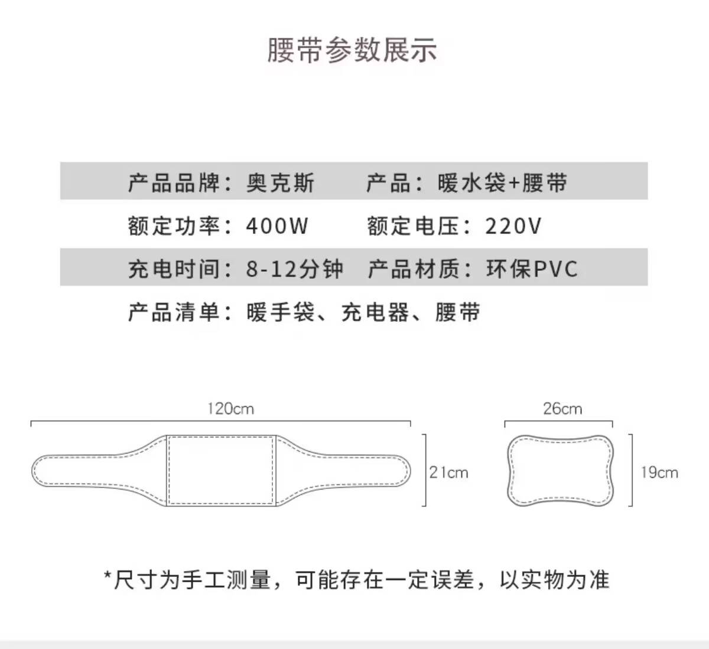

# 奥克斯热水袋售前常见问题

## 一、关于产品知识

### **1.** 产品区别是什么

```python
一体式:不能插手、不可拆洗 
双插手：可插手、不可拆洗
可拆洗款和腰带款:可插手、可拆洗
```

### **2.** 充电要充多久？

```python
亲爱哒、我们这款是把热水袋加热10分钟、然后放到暖套里面使用就可以持续室温下恒温3-6小时、被窝里面6-10小时，超耐用的呢
```

### **3.** 加热方式是什么？

```python
亲，我们采用u形加热管加热，国标品质 水电分离智能温控 达温断电
```

### **4.**.防爆吗？

```python
正品国标热水袋 高端防爆夹充电器 安全防爆 自动断电 质量可以放心
```

### **5.**.是国标的吗？

```python
这款奥克斯充电热水袋是国标的哈，升级国标发热管，智能防爆夹，加厚多层pvc，安心使用，升级双面毛绒，更长保温时间，送礼自用都可以
```

### **6.** 热水袋加热温度是多少？

```python
充电大概8-12分钟左右自动断电，充满大概65-70度左右哦
```

### **7.** 安全吗？

```python
采用6层高强度的保护层，加厚面料，抗压力强，自动断电防爆干烧，更加注重热水袋的安全,请您放心！
```

### **8.** 里面加什么水？

```python
热水袋是无腐自来水加注，干净放心无异味，6层pvc保护，高强度抗压抗摔，环保内胆水，内置加热器，水电分离满满安全感，选【可拆洗规格】可拆卸外衣，方便清洗。
```

### **9.** 需要自己加水吗？

```python
亲，水我们已经加好了呢，您这边收到以后充电以后，就可以直接使用了喔、
```

### **10.** 可以拆洗吗？

```python
亲，有可拆洗的选项呢，选择购买可拆洗的规格即可呢亲
```

### **11.** 哪些是可以洗的？

```python
亲亲一体式和双插手的不可以拆洗的亲后面带有防尘袋和腰带的可以分开腰带和防尘袋可以单独洗涤呢
```

### **12.** 免拆洗是什么意思

```c
免拆洗款的不能清洗呢，需要清洗的话需要购买可拆洗的规格呢亲
```

### **13.** 腰带尺寸是多少

```c
亲腰带尺寸约为：长≈120cm,腹部中心宽度≈20cm,腰带宽度≈9.5cm
```


