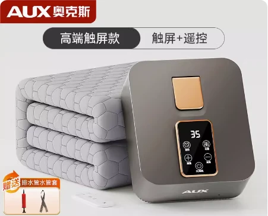

## 产品图片




## 产品参数

::: code-group

```c# [180*90]
【产品型号】:奥克斯高端款水暖毯S260-A-2（涤棉90*180）
【定时】:1-12小时
【功率】:400W
【除螨】:60度
【注水量】:约600ml
【总重量】:4kg
【规格尺寸】:180*90cm
【主机尺寸】:23*20*10cm
【主机重量】:约1.1KG
【电源线长】:1.2M
【水泵功率】:3-8w
【遥控距离】:2米
【温度区间】:20-60度
【除螨时长】:2小时
【功能按键】：除螨模式、预热模式、睡眠模式
【产品清单】:主机*1 毯体*1 打气筒*1 遥控器*1 说明书*1 水管套*1 连接管*2
【连接管长度】:约0.9m
【单换主机型号】:S260
```

```c# [180*120]
【产品型号】:奥克斯高端款水暖毯S260-A-3（涤棉120*180）
【定时】:1-12小时
【功率】:400W
【除螨】:60度
【注水量】:约600ml
【总重量】:4.4kg
【规格尺寸】:180*120cm
【主机尺寸】:23*20*10cm
【主机重量】:约1.1KG
【电源线长】:1.2M
【水泵功率】:3-8w
【遥控距离】:2米
【温度区间】:20-60度
【除螨时长】:2小时
【功能按键】：除螨模式、预热模式、睡眠模式
【产品清单】:主机*1 毯体*1 打气筒*1 遥控器*1 说明书*1 水管套*1 连接管*2
【连接管长度】:约0.9m
【单换主机型号】:S260
```

```c# [180*150]
【产品型号】:奥克斯高端款水暖毯S260-A-4（涤棉150*180）
【定时】:1-12小时
【功率】:400W
【除螨】:60度
【注水量】:约600ml
【总重量】:4.8kg
【规格尺寸】:180*150cm
【主机尺寸】:23*20*10cm
【主机重量】:约1.1KG
【电源线长】:1.2M
【水泵功率】:3-8w
【遥控距离】:2米
【温度区间】:20-60度
【除螨时长】:2小时
【功能按键】：除螨模式、预热模式、睡眠模式
【产品清单】:主机*1 毯体*1 打气筒*1 遥控器*1 说明书*1 水管套*1 连接管*2
【连接管长度】:约0.9m
【单换主机型号】:S260
```

```c# [180*200]
【产品型号】:奥克斯高端款水暖毯S260-A-5（涤棉200*180）
【定时】:1-12小时
【功率】:400W
【除螨】:60度
【注水量】:约600ml
【总重量】:5.3kg
【规格尺寸】:180*200cm
【主机尺寸】:23*20*10cm
【主机重量】:约1.1KG
【电源线长】:1.2M
【水泵功率】:3-8w
【遥控距离】:2米
【温度区间】:20-60度
【除螨时长】:2小时
【功能按键】：除螨模式、预热模式、睡眠模式
【产品清单】:主机*1 毯体*1 打气筒*1 遥控器*1 说明书*1 水管套*1 连接管*2
【连接管长度】:约0.9m
【单换主机型号】:S260
```
:::

