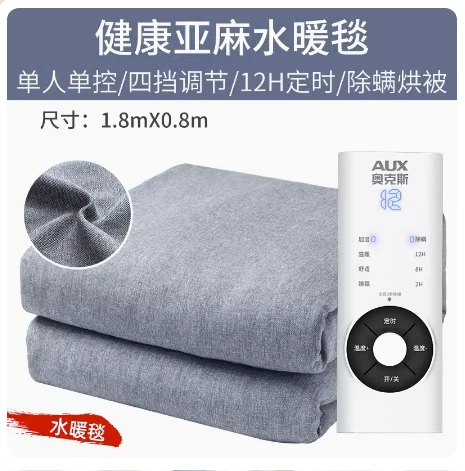

## 产品图片



::: warning 注意
亚麻水暖毯,`不可水洗，不可水洗，不可水洗!`
:::

## 产品参数

::: code-group

```c# [180*80]
【产品型号】:奥克斯水暖毯AC18-2（亚麻水暖毯180*80）
【定时】:2/8/12小时
【重量】:2.5KG
【功率】:70w
【适合床】:单人床/宿舍床
【档位数】:4档
【规格尺寸】:180*80cm
【电源线长】:1.5M
【温控方式】:单控
【除螨功能】:有
【最高温度】:60度
【产品清单】:毯子*1 说明书*1 注水器*1
【正反面料材质】:亚麻/无纺布
```

```c# [180*120]
【产品型号】:奥克斯水暖毯AC18-3（亚麻水暖毯180*120）
【定时】:2/8/12小时
【重量】:3.7KG
【功率】:115w
【适合床】:单人床/宿舍床
【档位数】:4档
【规格尺寸】:180*120cm
【电源线长】:1.5M
【温控方式】:单控
【除螨功能】:有
【最高温度】:60度
【产品清单】:毯子*1 说明书*1 注水器*1
【正反面料材质】:亚麻/无纺布
```

```c# [180*150]
【产品型号】:奥克斯水暖毯AC18-4（亚麻水暖毯180*150）
【定时】:2/8/12小时
【重量】:4.5KG
【功率】:125w
【适合床】:单人/双人床
【档位数】:4档
【规格尺寸】:180*150cm
【电源线长】:1.5M
【温控方式】:双控
【除螨功能】:有
【最高温度】:60度
【产品清单】:毯子*1 说明书*1 注水器*1
【正反面料材质】:亚麻/无纺布
```

```c# [200*180]
【产品型号】:奥克斯水暖毯AC18-5（亚麻水暖毯200*180）
【定时】: 2/8/12小时
【重量】:5KG
【功率】:140w
【适合床】:双人床
【档位数】:	4档
【规格尺寸】:200*180cm
【电源线长】:1.5M
【温控方式】:双控
【除螨功能】:有
【最高温度】:60度
【产品清单】:毯子*1 说明书*1 注水器*1
【正反面料材质】:亚麻/无纺布
```
:::

