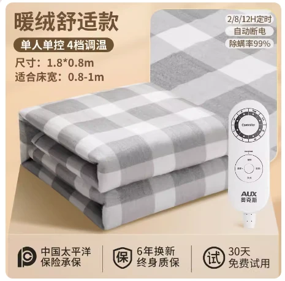

## 产品图片



## 产品参数

::: code-group

```c# [150*70]
【产品型号】:奥克斯电热毯AC30-1（无纺布灰格150*70）
【定时】:无
【重量】:1.2KG
【功率】:60w
【适合床】:躺椅
【档位数】:2档
【规格尺寸】:150*70cm
【电源线长】:1.5M
【温控方式】:单控
【除螨功能】:无
【最高温度】:45度
【产品清单】:毯子*1、说明书*1
【正反面料材质】:薄绒/无纺布
```

```c# [180*80]
【产品型号】:奥克斯电热毯AC30-2（无纺布灰格180*80）
【定时】:2/8/12小时
【重量】:1.3KG
【功率】:65w
【适合床】:单人床/宿舍床
【档位数】:4档
【规格尺寸】:180*80cm
【电源线长】:1.5M
【温控方式】:单控
【除螨功能】:有
【最高温度】:60度
【产品清单】:毯子*1、说明书*1
【正反面料材质】:薄绒/无纺布
```

```c# [180*120]
【产品型号】:奥克斯电热毯AC30-3（无纺布灰格180*120）
【定时】:2/8/12小时
【重量】:1.7KG
【功率】:115w
【适合床】:单人床/宿舍床
【档位数】:4档
【规格尺寸】:180*120cm
【电源线长】:1.5M
【温控方式】:单控
【除螨功能】:有
【最高温度】:60度
【产品清单】:毯子*1、说明书*1
【正反面料材质】:薄绒/无纺布
```

```c# [180*150]
【产品型号】:奥克斯电热毯AC30-4（无纺布灰格180*150）
【定时】:2/8/12小时
【重量】:2.3KG
【功率】:125w
【适合床】:单人/双人床
【档位数】:4档
【规格尺寸】:180*150cm
【电源线长】:1.5M
【温控方式】:双控
【除螨功能】:有
【最高温度】:60度
【产品清单】:毯子*1、说明书*1
【正反面料材质】:薄绒/无纺布
```

```c# [200*180]
【产品型号】:奥克斯电热毯AC30-5（无纺布灰格200*180）
【定时】: 2/8/12小时
【重量】:2.65KG
【功率】:140w
【适合床】:双人床
【档位数】:	4档
【规格尺寸】:200*180cm
【电源线长】:1.5M
【温控方式】:双控
【除螨功能】:有
【最高温度】:60度
【产品清单】:毯子*1、说明书*1
【正反面料材质】:薄绒/无纺布
```

:::

