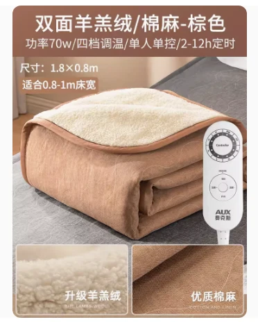
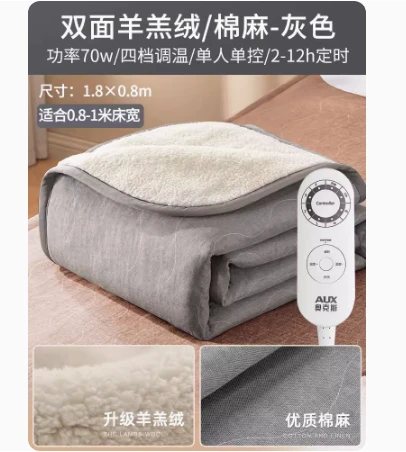

## 产品图片



## 产品参数

::: code-group
```c# [180*80]
【棕色型号】:奥克斯电热毯AC42-2(麻布卡其色羊羔绒180*80）
【灰色型号】:奥克斯电热毯AC40-2(麻布羊羔绒180*80）
【定时】:2/8/12小时
【重量】:1.7KG
【功率】:70w
【适合床】:单人床/宿舍床
【档位数】:4档
【规格尺寸】:180*80cm
【电源线长】:1.5M
【温控方式】:单控
【除螨功能】:有
【最高温度】:60度
【产品清单】:毯子*1、说明书*1
【正反面料材质】:羊羔毛/棉麻
```

```c# [180*120]
【棕色型号】:奥克斯电热毯AC40-3(麻布羊羔绒180*120）
【灰色型号】:奥克斯水暖毯AC18-3（亚麻水暖毯180*120）
【定时】:2/8/12小时
【重量】:2.5KG
【功率】:115w
【适合床】:单人床/宿舍床
【档位数】:4档
【规格尺寸】:180*120cm
【电源线长】:1.5M
【温控方式】:单控
【除螨功能】:有
【最高温度】:60度
【产品清单】:毯子*1、说明书*1
【正反面料材质】:羊羔毛/棉麻
```

```c# [180*150]
【棕色型号】:奥克斯电热毯AC40-4(麻布羊羔绒180*150）
【灰色型号】:奥克斯水暖毯AC18-4（亚麻水暖毯180*150）
【定时】:2/8/12小时
【重量】:3KG
【功率】:125w
【适合床】:单人/双人床
【档位数】:4档
【规格尺寸】:180*150cm
【电源线长】:1.5M
【温控方式】:双控
【除螨功能】:有
【最高温度】:60度
【产品清单】:毯子*1、说明书*1
【正反面料材质】:羊羔毛/棉麻
```

```c# [200*180]
【棕色型号】:奥克斯电热毯AC40-5(麻布羊羔绒200*180）
【灰色型号】:奥克斯水暖毯AC18-5（亚麻水暖毯200*180）
【定时】: 2/8/12小时
【重量】:3.8KG
【功率】:140w
【适合床】:双人床
【档位数】:	4档
【规格尺寸】:200*180cm
【电源线长】:1.5M
【温控方式】:双控
【除螨功能】:有
【最高温度】:60度
【产品清单】:毯子*1、说明书*1
【正反面料材质】:羊羔毛/棉麻
```

:::

