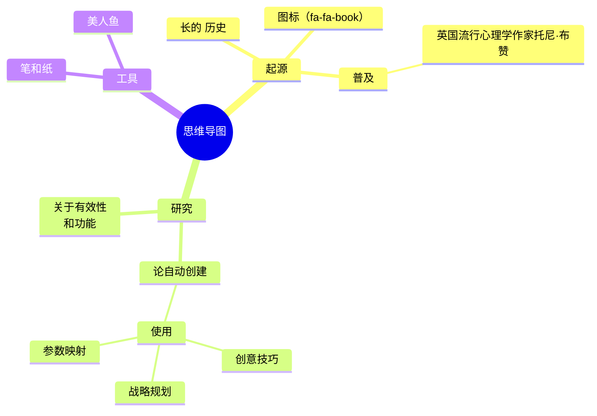
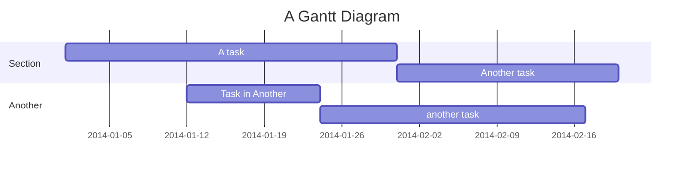
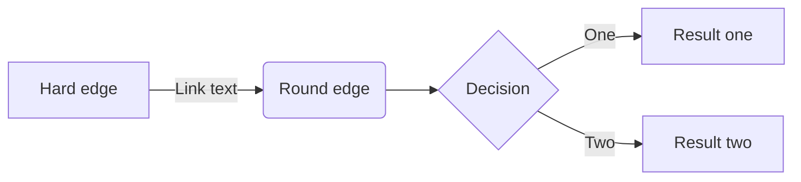
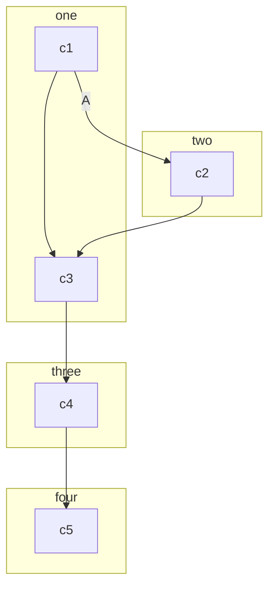
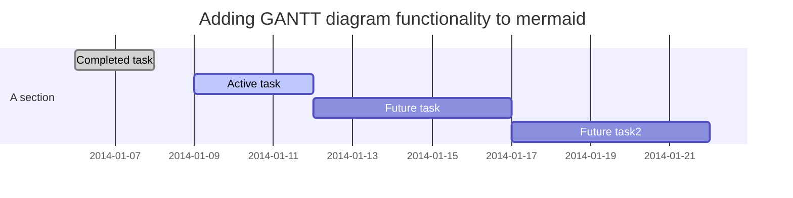
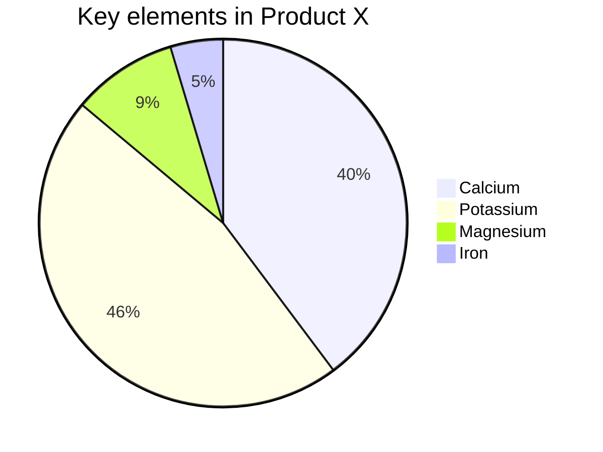
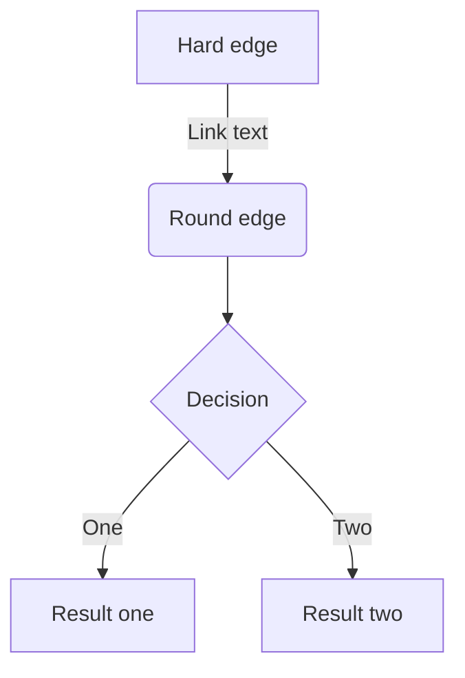
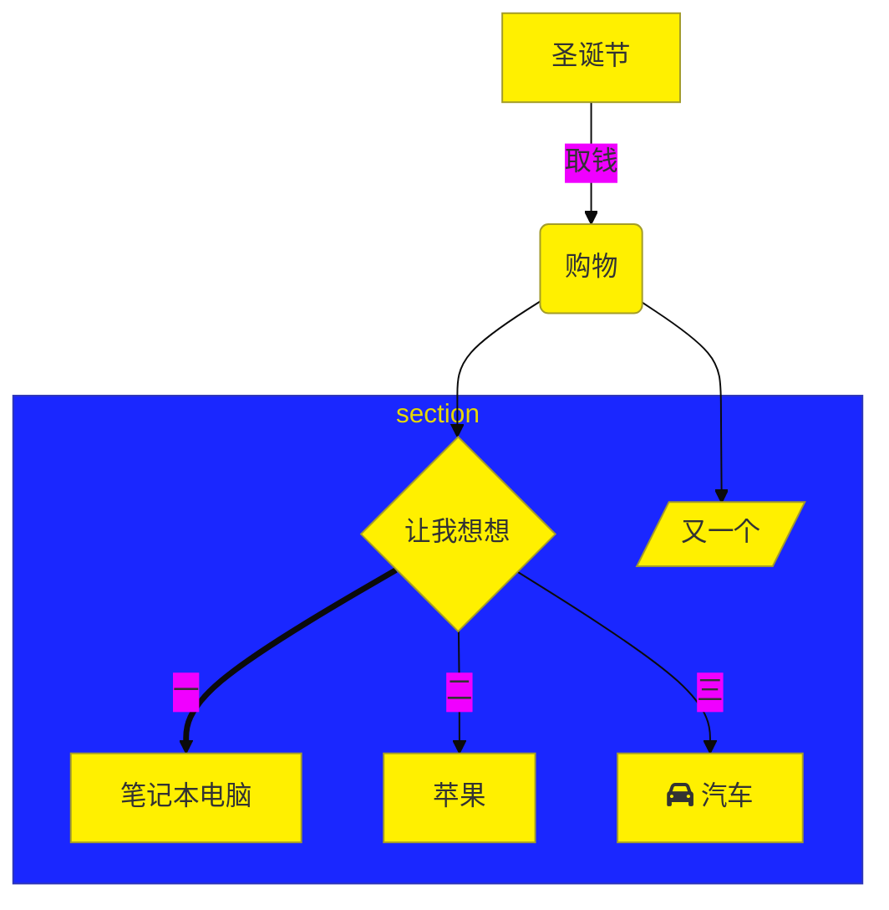

# 一级标题

## 二级标题

### 三级标题

#### 四级标题

##### 五级标题

###### 六级标题

标题样式来自[zj主题]（这是一个参考链接，按住ctrl键并点击将自动打开浏览器并跳转至相关链接，其中上标`[1]`只是一个额外的标注）

注：部分样式需要在偏好设置中开启，如上下标、行内公式、图表等。Markdown写法参考说明文档<sup><a href="https://support.typora.io/Markdown-Reference" alt="ref">🚀</a></sup>，试用其他如印象等在线Markdown编辑器<span alt="ref">[[Ref 1](https://www.zybuluo.com/mdeditor),[Ref 2](https://maxiang.io/),[Ref 3](https://editoe.com/),[Ref 4](https://b3log.org/vditor)]</span>

行内公式：$\lim\limits_{x \to \infty} \exp(-x)=0$，行间公式：
$$
E_0 = mc^2 \\
\quad\text{—— Albert Einstein}
$$

推荐：[latex手写公式识别](http://draw.mathpix.com/)、[latex公式编辑器](https://www.latexlive.com/)

可以直接用尖括号包裹URL链接或邮箱：<https://emojixd.com/>

> 提示块标签
>
> > 嵌套提示块


- 无序列表1

- 无序列表2

1. 有序列表1[^1]
2. 有序列表2

__加粗__，*斜体*，***斜体加粗***，~~删除线~~，<u>下划线</u>。`<font>`标签被我用于一款小标签样式（[小康](https://www.antmoe.com/posts/3b43914f/)）：<font>红色小标签</font>，可以通过设置`background-color`属性控制背景色，如：<font style="background-color:#8bc34a">绿色小标签</font>，为了方便，我提供了五种预定义的颜色（包括前面的红色、<span alt="glow">绿色</span>）：<font title="blue">蓝色小标签</font>、<font title="yellow">黄色小标签</font>、<font title="gray">灰色小标签</font>。一些强调型格式：<span alt="underline">下划线</span>、<span alt="emp">着重号</span>、<span alt="wavy">波浪线</span>。其他：<span alt="hide">隐藏文本</span>，<span alt="hollow">空心字</span>，<span alt="blink">字体闪烁</span>

<span alt="rainbow">彩虹变换字体特效</span>（嫖自[黑石大佬](https://www.heson10.com/posts/21347.html)🙇‍♀️），<span alt="modern">欢迎光临</span>（嫖自[QinXS](https://7bxing.com/friends/)🙇‍♀️）


```diff
+ 新增行
- 删除行
其他行
```

<!-- 插入网易云的外链播放器（`<iframe>`，可嵌入油管等平台视频）： -->
<!-- <iframe frameborder="no" border="0" marginwidth="0" marginheight="0" src="//music.163.com/outchain/player?type=2&id=1342183925&auto=0"></iframe>
<video src="./temp/难破船.mp4"></video> -->


```[标题测试]
12312
123
123
123
```







```mermaid
sequenceDiagram
    participant Alice
    participant Bob
    Alice->>John: Hello John, how are you?
    loop Healthcheck
        John->>John: Fight against hypochondria
    end
    Note right of John: Rational thoughts prevail!
    John>Alice: Great!
    John->>Bob: How about you?
    Bob-->>John: Jolly good!
```
















亲，请协助提供以下10项完整凭证：
1️⃣ 外包装六面体高清照片（含封箱胶带状态）
2️⃣ 装箱清单完整展开图（需清晰显示所有条目）
3️⃣ 快递面单特写（展示签收人/日期/重量信息）
4️⃣ 拆箱全程视频（连续无剪辑，含开箱过程）
5️⃣ 配件独立包装状态图（展示封口完整性）
6️⃣ 商品序列号特写（机身铭牌+外包装对照）
7️⃣ 物流轨迹完整截图（含所有节点时间戳）
8️⃣ 填充物分布全景图（展示包装内部状态）
9️⃣ 防伪标签验证视频（官网查询过程录制）
🔟 签收环境全景照片（展示签收时周边环境）