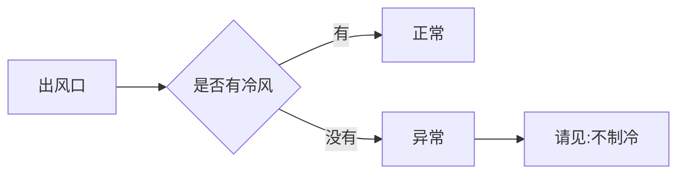
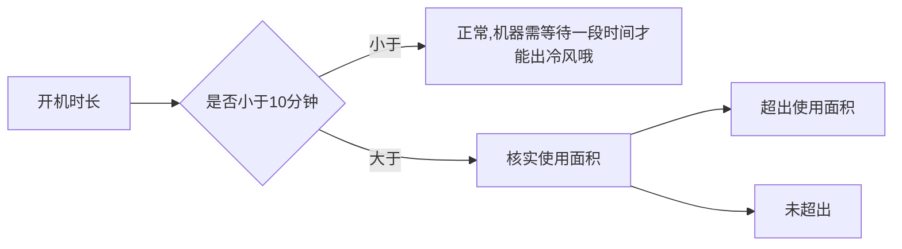

# 移动空调售后问题
## 一、制冷效果类问题
### 1.1 效果不佳
##### 处理流程：
1️⃣ 基础排查：
* 确认出风口是否为冷风 (冷风正常)-->非冷风请见:`不制冷`
* 询问开机时长(＜10分钟需等待)
* 确认房间面积与匹数匹配度

---

##### 基础核实短语
::: code-group

```c# [风口检查]
亲，用手感受出风口的风是冷风吗，排风口的风是热的吗
```

```c# [开机时长|使用面积]
亲，您这边开机有多长时间呢，房间面积大概是多少平呢
```

:::

---

##### 判断标准
**风口核实逻辑**

---

**开机时长**

---

##### 基础排查阶段解决话术
::: code-group

```c# [出风口为冷风]
亲，出风口是冷风说明机器正常制冷哦，建议关闭门窗再观察一段时间~
```

```c# [面积过大]
亲，您的房间面积更适合XX匹的机型，补差价可免费换货哦~
```

:::

---

2️⃣ 环境核实：
* 要求提供设置温度面板图
* 拍摄空调周边50cm环境图

---

##### 环境核实短语
::: code-group

```c# [环境检查]
亲，可以麻烦您拍2张图片给我吗
第一张：拍摄清晰可见的面板图片，展示设置温度和当前模式
第二张：离机器50厘米远，拍一张空调的完整图片
```
:::

##### 图片示例


---


##### 环境排查阶段解决话术
`局部制冷特性:`

```python
亲，移动空调主打局部快速降温，建议直吹使用。全屋降温需一些时间呢，可调低温度并关闭门窗等待降温过程呢亲~
```

`匹数不匹配:`

```python
检测到您的XX㎡空间更适合XX匹机型，补差价升级可享免费换货+运费补贴，需要帮您操作吗？
```

### 1.2 完全不制冷
##### 处理流程：
1️⃣ 核心排查：
- 检查出风/排风温差  --> 无温差则压缩机未启动
- 确认设置温度低于室温5℃以上
- 检查是否显示E4/E2/P1故障代码

2️⃣ 进阶排查：
- 电压稳定性检测
- 模式是否正确 --> 需制冷非送风模式

##### 应对方案：
`温差不足：`
```python
压缩机需设置温度低于室温5℃才会启动哦，建议将温度调至XX℃试试~
```

`过热保护：`
```python
连续工作8小时建议休息1小时，既保护机器又节能呢！
```

## 二、设备异常类问题
### 2.1 漏水问题
##### 分级处理：
✅ 轻度滴水：`排风管微量水汽属正常物理现象，连接排水管即可解决~`

❗持续漏水：
- 检查排水管连接状态
- 垫高前轮引导排水
- 仍无法解决则安排换货

### 2.2 异响/噪音
##### 标准操作：
要求拍摄：
- 送风模式30秒视频（1米距离）
- 制冷模式30秒视频（1米距离）

##### 应对策略：
▫️环境降噪建议：`底部垫泡沫+调低风速可降噪3-5分贝，给您申请20元补偿可以吗？`

▫️质量异常：`视频核实后立即换货+运费补贴`

## 三、硬件故障类问题
### 3.1 按键失灵
##### 诊断流程：
- 区分面板/遥控器故障
##### 要求操作视频：
- 面板所有按键响应测试
- 遥控器功能测试（含电池检测）

##### 解决方案：
- 面板故障：`补偿方案/换货二选一`
- 遥控故障：`48小时内补发新遥控器`

### 3.2 机身结冰
##### 排查重点：
- 温度设置是否≤18℃
- 过滤网清洁状态
- 拍摄结冰部位特写图

##### 处理方案：
- 操作不当：`建议温度设置在22-26℃之间，每月清洁过滤网更节能哦~`
- 设备故障：`直接换货+赠送清洁套装`

## 四、物流售后类问题
### 4.1 错发/漏发
##### 处理SOP：
- 核对订单与实拍图
- 仓库留存视频核查

##### 差异化补偿：
- 低配错发：`退差价+补偿`
- 高配错发：`免费升级话术`

## 4.2 外观破损
### 分级处理：
- 轻微划痕：`补偿30-50元+赠品`
- 功能损坏：`次日上门换新+补偿`

## 标准化服务条款
1️⃣ 信息采集话术：`麻烦提供①设置界面图 ②故障部位视频（1米距离30秒） ③整体环境图`

2️⃣ 补偿体系：
- 体验问题：`20-50元优惠券`
- 质量问题：`换货+运费险+50元补偿`
- 重大故障：`极速退款+专员跟进`

3️⃣ 时效承诺：
- 简单问题：`2小时内响应`
- 换货处理：`24小时发出新机`
- 上门服务：`48小时内完成`


