# 移动空调售后问题处理指南
## 一、制冷效果问题处理流程
### 制冷效果不佳解决方案
#### 🔍 双阶段排查流程
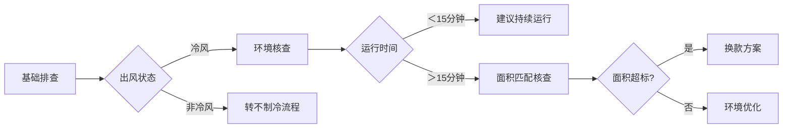

#### 📝 标准处理步骤
##### 基础排查
1️⃣出风状态排查

::: code-group

```c# [出风状态验证]
亲，用手感受出风口的风是冷风吗，排风口的风是热的吗?
```

```c# [有冷风但是效果不好]
1.亲，机器工作10分钟后，用手感受出风口处，出风为凉风，就是正常在工作制冷的哦，您把门窗关好，室内会慢慢降温的哦
2.亲，移动空调主打是方便移动和局部制冷效果好呢，不像挂机空调区别内外机需要专业安装，所以效果和速度上会慢一些，您可以多开一会儿呢
3.您也可以使用直吹的方式快速降温，局部制冷效果确实不错哒，小的单独给您申请优惠一些，您看是否可以呢
```

```c# [没有冷风]
往下排查
```
:::

---
2️⃣开机时长与使用面积核查
::: code-group
```c# [开机时长|使用面积]
亲，您这边开机有多长时间呢，房间面积大概是多少平呢
```
```c# [使用面积超标]
亲，您这个面积我们一般都是建议配**这个匹数的使用，您下单的这个匹数有点小，您看要不补个差价我们给您换大匹数的，
换货的运费我们给您出，您看是否可以
```

```c# [开时长过短]
亲，机器工作10分钟后，用手感受出风口处，出风为凉风，就是正常在工作制冷的哦，您把门窗关好，室内会慢慢降温的哦
```

```c# [面积|时长正常]
检查使用环境
```
:::

---
3️⃣判断标准
::: details 冷风+热排风=正常制冷
亲，机器工作10分钟后，用手感受出风口处，出风为凉风，就是正常在工作制冷的哦，您把门窗关好，室内会慢慢降温的哦
:::
::: details 开机＜10分钟→建议继续运行观察
亲，移动空调主打是方便移动和局部制冷效果好呢，不像挂机空调区别内外机需要专业安装，所以效果和速度上会慢一些，您可以多开一会儿呢
:::


`出风口非冷风→见不制冷故障`

---

##### 环境核实
1️⃣ 核实内容
* 要求提供设置温度面板图
* 拍摄空调周边50cm环境图

2️⃣ 图片示例


---

3️⃣ 核实话术
::: code-group

```c# [环境检查]
亲，可以麻烦您拍2张图片给我吗
第一张：拍摄清晰可见的面板图片，展示设置温度和当前模式
第二张：离机器50厘米远，拍一张空调的完整图片
```
:::

---
##### 常见问题处理
::: code-group

```c# [局部制冷特性说明]
亲，移动空调主打局部快速降温，建议直吹使用，全屋降温需要时间~
```

```c# [匹数不匹配方案]
亲,您的XX㎡空间更适合XX匹机型，补差价可免费换货+运费补贴~
```

```c# [出风口正常]
"出风口凉风说明正常制冷，请关闭门窗继续观察呢亲,整体降温需要时间呢亲"
```

```c# [面积过大处理]
"您的房间面积更适合XX匹机型，现在补差价可免费换货哦~"
```

```c# [机器环境]
工作模式和温度，以及机器的四周直径50厘米内需要保持空旷，这样可以保证空调的正常运行，
如果四周没有保持空旷，那会影响空调的进风和排风，会影响使用效果
```


:::

---

##### 争议问题解决思路
1. 出风口凉风说明正常工作，建议持续运行 `顾客表示不满时,可主动提及优惠`
2. 强调移动空调局部制冷特性  `顾客对效果表示不满时,可主动提及优惠`
3. 顾客对效果不满意时  `可主动提及优惠`
4. 顾客使用面积过大时  `主动协商补差价更换大匹数,或者购入多台`

---

##### 注意事项
- 该问题为`高频发`,做好`足够`话术应对
- 避免直接否定客户感受
- 主要解决方案为:`优惠补偿`或`补差价换大匹数`

---

## 二、完全不制冷处理流程

### 1.2 完全不制冷
#### 🔧 排查流程
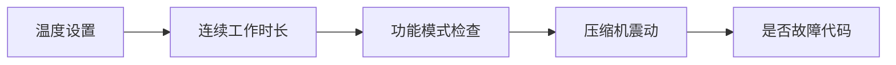

---

#### 📋 标准处理步骤
##### 第一阶段：核心排查
1️⃣温度设置检查

::: code-group
```c# [温度设置排查]
亲设定温度药比现在房间温度至少低5℃，比如现在室温30℃的话，调到25℃以下，这样制冷功能才会正常启动呢！
```
:::

2️⃣过热检查
::: code-group
```c# [过热保护排查]
亲，机器压缩机长时间运行，温度达到115度时，压缩机会过热保护，停止工作，待温度下降后会重新启动哦，
建议每隔8小时关机1小时左右，这样有利于延长使用寿命哦
```
:::

3️⃣电压检查
::: code-group
```c# [电压排查]
亲，您家里如果大功率电器使用较多的话，会影响电压稳定哦，您可以尝试关掉1-2个大功率电器，在重新开机试下哦
```
:::


3️⃣故障代码检查
::: code-group
```c# [故障代码]
亲屏幕是否有显示：E4、E2、P1等故障呢? 此为水满提示，需要排水，此时拔掉排水塞，排水完成后，压缩机会重新启动工作
注：为避免频繁水满排水，可选择连接排水管使用
```
:::

4️⃣功能模式检查
::: code-group
```c# [功能检查]
亲,选择的是什么模式呢？请将模式调为制冷模式喔,自动模式会根据温度自动切换制冷和送风模式哦
```
:::

---


## 三、噪音/异响处理流程
### 3.1 噪音问题排查
#### 🔍 双视频验证流程
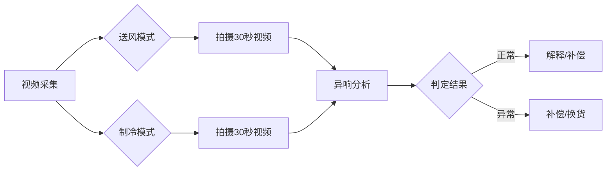
#### 📝 标准处理步骤

::: code-group
``` [核实短语]
亲，抱歉给您带来不便了，需要您配合拍2个视频：
1. 切换为送风模式，离机器1米远拍摄30秒视频
2. 切换为制冷模式，同样距离拍摄30秒视频
这样我们才能准确判断问题呢~
```
:::

##### 判定标准
1️⃣正常工作情况
::: code-group

``` c# [行业对比]
亲，咱的移动空调针对压缩机和面壳做了降噪处理的，声音分贝在50-55dB左右，在整个行业是比较低的
```

``` c# [运行声]
移动空调将挂机内外机集为一体，压缩机工作时会产生运行声，这是行业共性现象呢
```

``` c# [降噪建议]
建议三种降噪方法：
1. 切换低风速模式
2. 底部加垫泡沫缓冲
3. 保持机器周边50cm空旷
```

```c# [分贝测量规范]
国家标准测量分呗是离机器1米远进行测量，距离太近会影响测试结果哦！
```

``` c# [申请补偿]
考虑到您的体验，我们特别申请XX优惠补偿，您看这样可以吗？
```
:::


2️⃣ 异常情况处理
::: code-group

``` c# [补偿方案]
十分抱歉,给您带来不便,我们特别申请XX补偿,您看这样可以吗？
```

``` c# [换货方案]
抱歉呢亲,这边给您安排换货,来回运费我们承担,请您放心！
```

``` c# [换货+补偿方案]
抱歉呢亲,这边给您安排换货,来回运费我们承担,并且给您申请了XX补偿,您看这样可以吗？
```
:::


##### 相关短语：
::: code-group

```c# [分贝检测标准]
国家标准测量分呗是离机器1米远进行测量，距离太近会影响测试结果哦！
```

```c# [分贝]
亲，咱的移动空调针对压缩机和面壳做了降噪处理的，声音分贝在50-55dB左右，在整个行业是比较低的
```

```c# [压缩机声音]
移动空调是一体机，把挂机的内外机集为一体的，所以当压缩机在启动工作的时候是会有些声音呢
```

```c# [降噪建议]
市场上的移动空调都是一样哒，底部垫泡沫+调低风速可降低分贝，给您申请20元补偿可以吗？
```

```c# [申请优惠]
移动空调是减少了咱们挂机专业的安装，而且方便移动，效果也是不错哒，户外露营这些都是非常方便的呢，
您看这边单独给您申请优惠一些可以吗
```
:::

#### 特殊争议处理
::: code-group
``` c# [分贝检测标准]
亲，国家噪音检测标准要求：
1. 测量距离1米以上
2. 环境安静,低于机器10分贝
3. 使用专业分贝仪测量
辛苦您按标准,重新拍下检测视频,感谢！
```
:::

#### 注意事项
- 此问题为**高频问题**,需要高熟练处理,做好短语储备
- 优先采取 `解释` 结合 `补偿` 解决
- 异响时补偿不接受,应引导换货处理
- 无异响时`不采取换货策略`,主要解决渠道为-->`补偿方案`
- 顾客检测分贝异常时,需核实是否符合检测标准


## 四、漏水问题
#### 🔍 三级诊断流程
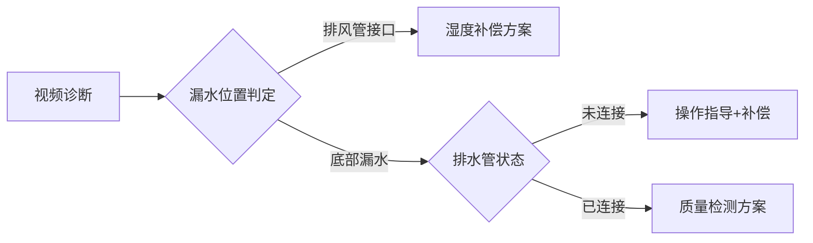

#### 📝 标准处理步骤
::: code-group

```c# [核实规范]
亲，请协助拍摄30秒视频需包含：
1.机器水平放置状态（展示地面平整度）
2.排水口特写（是否连接排水管）
3.漏水点动态（展示出水量）
注意：请保持机器持续运行拍摄哦~
```
:::

##### 漏水类型判定
1️⃣ 排水管接口渗水
```
亲，这是冷凝水雾化排放的正常现象：
1. 湿度＞70%时，雾化系统可能残留微量水珠
2. 每8小时渗水＜20ml属安全范围（约4瓶盖量）
```
> 解决思路:`连接排水管使用`

---

2️⃣ 底部漏水（未接排水管）
```
排查方案：
1. 关机后垫高前轮2cm
2. 检查双层排水塞是否完全拔除
3. 连接排水管并保持坡度＞5°
```
> 连接排水管排水
>无法解决则:安排`上门检测` 或 `换货`

---

3️⃣ 底部漏水（已接排水管）
```
亲，可能是内部的储水槽问题，您看这边帮您预约师傅上门检测维修或者给您安排换一台，是否可以呢，您看怎么方便些
```

<!-- %%{init: {'theme': 'base', 'themeVariables': { 'primaryColor': '#fff000'}}}%% -->
## 五、不出风
#### 出风口检测
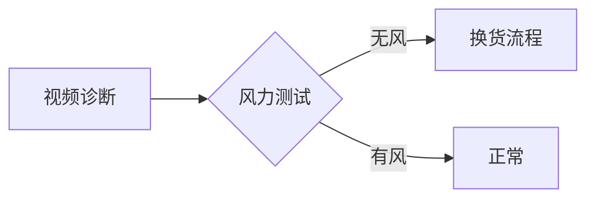

#### 📝 标准处理步骤
##### 视频采集规范
::: code-group
```c# [核实规范]
亲，请按以下步骤拍摄验证视频：
1️⃣ 通电后切换至「送风模式」
2️⃣ 用纸巾三处出风口（左/中/右）
3️⃣ 保持拍摄30秒完整运行状态
（注意展示控制面板模式设定）
```
:::

##### 故障判定标准
1️⃣ 完全不出风（质量问题）
###### 核心故障特征
- 3处出风口纸巾均无飘动

###### 处理方案
```c#
亲，这是非常抱歉给您带来不便了，您看这边帮您预约师傅上门检测维修或者给您安排换一台，是否可以呢，您看怎么方便些
```

## 六、不出水问题排查流程
#### 🔍 三级诊断体系

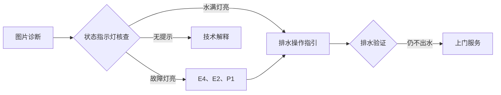

#### 📝 标准处理步骤
::: code-group
``` c# [核实规范]
亲，请提供以下2张高清图片：
1️⃣ 控制面板特写（需显示所有指示灯）
2️⃣ 排水口45度角拍摄（展示塞子状态）
```
:::


##### 核心排查流程
1️⃣ 基础状态核查
- 水满指示灯状态：□常亮 □闪烁 □熄灭
- 故障代码显示：□E4 □E2 □P1 □无
- 排水管连接：□已接 □未接
- 排水塞层级：□单层拔出 □双层拔出
----

2️⃣ 排水口检测
##### 双排水系统操作指南
1. 检查排水口是否为双层,外层拔出,内层未拔出-->导致堵塞
2. 如是双排水口尝试将排水管接入第二排水口
3. 尝试往后倾斜机器,是否可以排出

##### 分级处理方案
1️⃣ 正常不出水情况
``` c#
亲，这是我们的免排水技术：
1. 85%冷凝水通过雾化系统循环利用
2. 仅当连续运行＞8小时或湿度＞80%时启动排水
3. 水满灯未亮说明储水量＜200ml（无需排水）
```

2️⃣ 水满不出水
###### 处理四步法

``` c#
1. 安全断电后机身倾斜15度保持2分钟
2. 使用标配通管器清洁排水通道
3. 检查双重排水塞完全拔出,排水口通畅
4. 双排水口则尝试接入第二排水口
```

## 七、结冰问题排查流程
#### 7.1 三级诊断体系
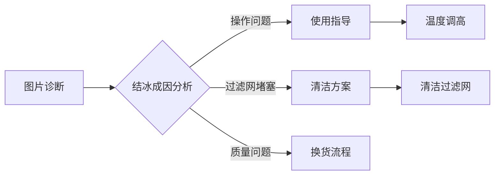

#### 📝 标准处理步骤
::: code-group
``` c# [核实规范]
亲，请协助拍摄以下3张高清图片：
1️⃣ 结冰部位特写（展示冰层厚度）
2️⃣ 过滤网正反面（需看清网孔状态）
3️⃣ 机身铭牌完整信息（含生产批次号）
```
:::
##### 图片示例
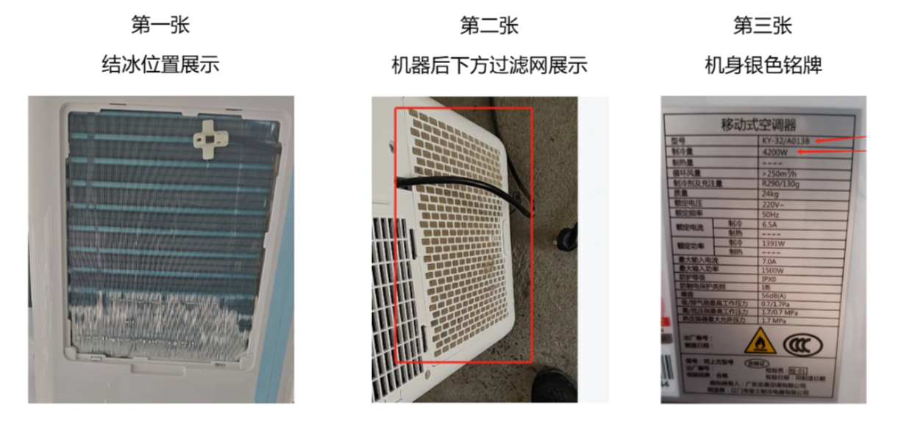

---

##### 分级处理方案
1️⃣ 操作问题（温度设置过低）
``` c#
亲，使用空调时，刚开的时候可以设置低些，但是工作2小时左右后，建议把温度上调一点哦，
可以让空调更好的工作，同时也可以避免温度过低导致感冒哦
```

2️⃣ 维护问题（过滤网脏堵）
``` c#
亲，移动空调的过滤网需要定期清理哦，有利于空调工作时的空气流通，不但可以维持良好的使用效果，还可以保持室内空气清新哦
```

3️⃣ 质量问题（部件故障）
```
非常抱歉给您带来不便了亲，您这个情况可能是风机或压缩机故障，这边为您预约快递取件寄回更换一台是否可以呢
```

## 八、按键失灵处理流程
#### 8.1 三级诊断体系
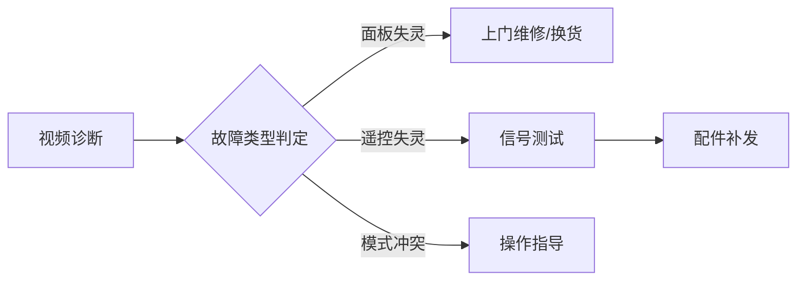

#### 📝 标准处理步骤
##### 视频采集规范
::: code-group
``` c# [核实规范]
亲，请按顺序拍摄以下视频片段：
1️⃣ 面板操作：依次按压所有功能键（每个按键持续3秒）
2️⃣ 遥控操作：展示电池安装状态+所有按键响应
3️⃣ 同步验证：同时展示面板和遥控操作（证明信号接收）
```
:::


##### 分级处理方案
1️⃣ 面板按键失灵
```
1.亲抱歉给您带来不便了，这个可能是空调内部的硬件故障了，
2.您看遥控器是否可以控制呢，遥控可以用的话，就用遥控控制可以吗，我这边单独给您申请些优惠，
也避免您这边换货来回寄，耽误您使用呢
```

2️⃣ 遥控器失灵
```
1.亲,可能是电池没电了,需要更换电池呢
2.亲,可能遥控器内部故障了，您看这几天辛苦您先在空调上操作，我这边帮您加急安排补发一个遥控器，您看是否可以呢
```

3️⃣ 模式冲突
```
亲,需要在制冷或者制热模式下才可以操作设置温度呢
```

## 九、发错货问题处理流程
#### 9.1 三步诊断体系
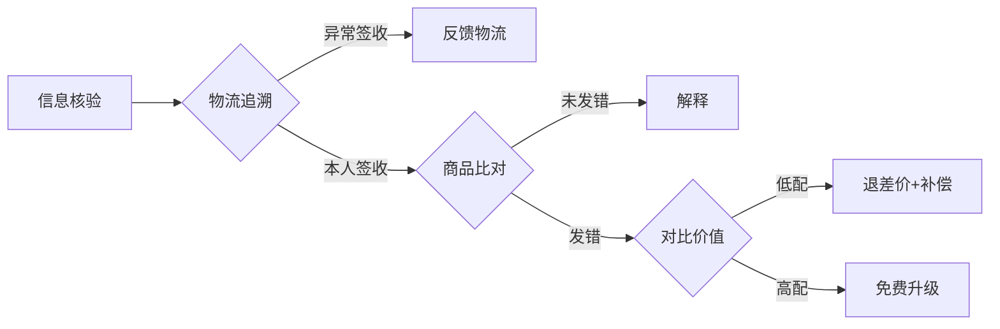

#### 📝 标准处理步骤
##### 核实阶段
```
亲，请协助提供以下凭证：
1️⃣ 外包装标签贴（含型号/生产日期）
2️⃣ 机器操作面板
3️⃣ 快递面单高清图（需看清单号和发货地）
4️⃣ 机身铭牌特写（含型号/制冷量）
```
##### 图片参考
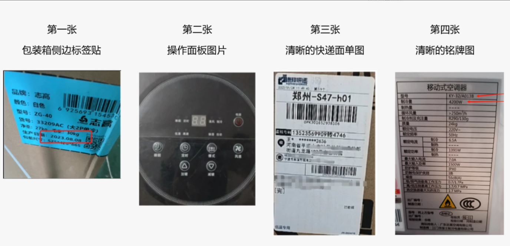

---
1️⃣ 同质化发错（功能匹数相同）
```
亲，这边看到您收到的是同性能机型（功能/匹数相同）,这边给您申请优惠xx元您看可以吗？
```

2️⃣ 降级发错（匹数或参数低于订单）
```
亲，抱歉给您带来不便了，可能是打包小哥这边不小心拿错了，您看这款家里可以用吗，
这边给您退差价外加额外优惠一些是否可以呢
```
3️⃣ 升级发错（匹数或参数高于订单）
```
亲，抱歉给您带来困扰了，这边仓库反馈是给您免费做了升级换发的，这款匹数和制冷量更大，
使用的效果更好哦
```

4️⃣ 跨品牌发错
```
亲，咱们是云仓发货的，可能是仓库小哥这边不小心弄错了，您看这边给您申请额外优惠一些可以吗?
```


## 十、破损/污渍/划痕处理流程
#### 10.1 损伤判定体系
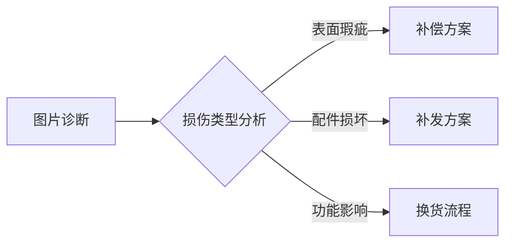

##### 分级处理方案
1️⃣ 表面瑕疵
```
亲，这个可能是打包的时候不小心弄的，您看这个影响使用的吗，不影响的话，我这边给您申请额外优惠些可以吗
```

2️⃣ 配件损坏
```
亲，这个可能是快递路上不小心弄的，这边给您安排补寄配件，您到货后更换一下可以吗，而且在给您申请优惠一点
```

3️⃣ 功能影响
```
亲，抱歉给您带来不便了，这个可能是快递中途不小心弄的，您看这边为您安排取件退回为您更换可以吗?
```

## 十一、少件/漏发处理流程
#### 11.1 核验体系
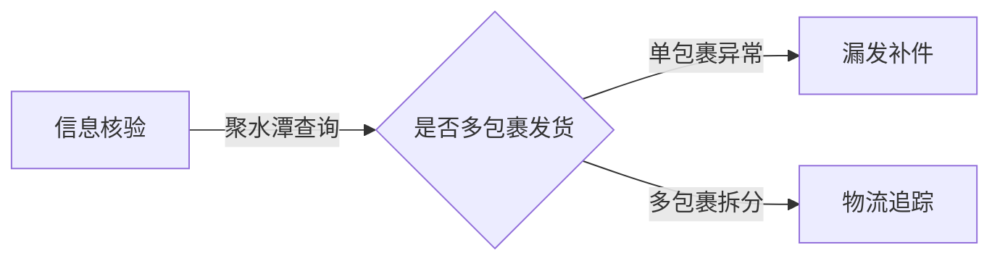
---

::: code-group
``` c# [核实]
亲，请协助提供以下凭证：
1️⃣ 收到的全部商品和配件放在一起拍照
2️⃣ 快递面单特写（需清晰可见）
3️⃣ 快递包装箱图片
```
:::

##### 分级处理方案
1️⃣ 确认漏发
```
亲，抱歉给您带来不便了，可能是仓库小哥打包的时候遗漏了，这边让仓库给您加急补发，您看可以吗
```

2️⃣ 拆分发货
```
亲，您的订单是多包裹发货的，另外的单号是*******，
物流正在运输中，请您在耐心待待一下哦
```
