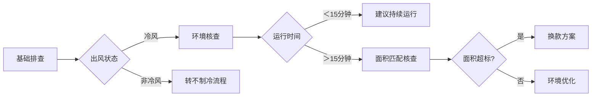
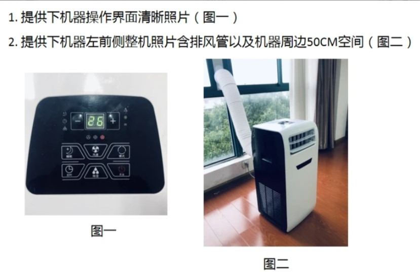
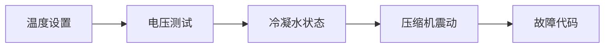
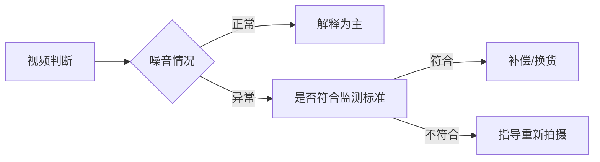

# 移动空调售后问题处理指南
## 一、制冷效果问题处理流程
### 制冷效果不佳解决方案
#### 🔍 双阶段排查流程


#### 📝 标准处理步骤
##### 基础排查
1️⃣出风状态排查

::: code-group

```c# [出风状态验证]
亲，用手感受出风口的风是冷风吗，排风口的风是热的吗?
```

```c# [有冷风但是效果不好]
1.亲，机器工作10分钟后，用手感受出风口处，出风为凉风，就是正常在工作制冷的哦，您把门窗关好，室内会慢慢降温的哦
2.亲，移动空调主打是方便移动和局部制冷效果好呢，不像挂机空调区别内外机需要专业安装，所以效果和速度上会慢一些，您可以多开一会儿呢
3.您也可以使用直吹的方式快速降温，局部制冷效果确实不错哒，小的单独给您申请优惠一些，您看是否可以呢
```

```c# [没有冷风]
往下排查
```
:::

---
2️⃣开机时长与使用面积核查
::: code-group
```c# [开机时长|使用面积]
亲，您这边开机有多长时间呢，房间面积大概是多少平呢
```
```c# [使用面积超标]
亲，您这个面积我们一般都是建议配**这个匹数的使用，您下单的这个匹数有点小，您看要不补个差价我们给您换大匹数的，
换货的运费我们给您出，您看是否可以
```

```c# [开时长过短]
亲，机器工作10分钟后，用手感受出风口处，出风为凉风，就是正常在工作制冷的哦，您把门窗关好，室内会慢慢降温的哦
```

```c# [面积|时长正常]
检查使用环境
```
:::

---
3️⃣判断标准
::: details 冷风+热排风=正常制冷
亲，机器工作10分钟后，用手感受出风口处，出风为凉风，就是正常在工作制冷的哦，您把门窗关好，室内会慢慢降温的哦
:::
::: details 开机＜10分钟→建议继续运行观察
亲，移动空调主打是方便移动和局部制冷效果好呢，不像挂机空调区别内外机需要专业安装，所以效果和速度上会慢一些，您可以多开一会儿呢
:::


`出风口非冷风→见不制冷故障`

---

##### 环境核实
1️⃣ 核实内容
* 要求提供设置温度面板图
* 拍摄空调周边50cm环境图

2️⃣ 图片示例


---

3️⃣ 核实话术
::: code-group

```c# [环境检查]
亲，可以麻烦您拍2张图片给我吗
第一张：拍摄清晰可见的面板图片，展示设置温度和当前模式
第二张：离机器50厘米远，拍一张空调的完整图片
```
:::

---
##### 常见问题处理
::: code-group

```c# [局部制冷特性说明]
亲，移动空调主打局部快速降温，建议直吹使用，全屋降温需要时间~
```

```c# [匹数不匹配方案]
亲,您的XX㎡空间更适合XX匹机型，补差价可免费换货+运费补贴~
```

```c# [出风口正常]
"出风口凉风说明正常制冷，请关闭门窗继续观察呢亲,整体降温需要时间呢亲"
```

```c# [面积过大处理]
"您的房间面积更适合XX匹机型，现在补差价可免费换货哦~"
```

```c# [机器环境]
工作模式和温度，以及机器的四周直径50厘米内需要保持空旷，这样可以保证空调的正常运行，
如果四周没有保持空旷，那会影响空调的进风和排风，会影响使用效果
```


:::

---

##### 争议问题解决思路
1. 出风口凉风说明正常工作，建议持续运行 `顾客表示不满时,可主动提及优惠`
2. 强调移动空调局部制冷特性  `顾客对效果表示不满时,可主动提及优惠`
3. 顾客对效果不满意时  `可主动提及优惠`
4. 顾客使用面积过大时  `主动协商补差价更换大匹数,或者购入多台`

---

##### 注意事项
- 该问题为`高频发`,做好`足够`话术应对
- 避免直接否定客户感受
- 主要解决方案为:`优惠补偿`或`补差价换大匹数`

---

## 二、完全不制冷处理流程

### 1.2 完全不制冷
#### 🔧 排查流程


---

#### 📋 标准处理步骤
##### 第一阶段：核心排查
1️⃣温度设置检查

::: code-group
```c# [温度设置排查]
亲设定温度药比现在房间温度至少低5℃，比如现在室温30℃的话，调到25℃以下，这样制冷功能才会正常启动呢！
```
:::

2️⃣过热检查
::: code-group
```c# [过热保护排查]
亲，机器压缩机长时间运行，温度达到115度时，压缩机会过热保护，停止工作，待温度下降后会重新启动哦，
建议每隔8小时关机1小时左右，这样有利于延长使用寿命哦
```
:::

3️⃣电压检查
::: code-group
```c# [电压排查]
亲，您家里如果大功率电器使用较多的话，会影响电压稳定哦，您可以尝试关掉1-2个大功率电器，在重新开机试下哦
```
:::


3️⃣故障代码检查
::: code-group
```c# [故障代码]
亲屏幕是否有显示：E4、E2、P1等故障呢? 此为水满提示，需要排水，此时拔掉排水塞，排水完成后，压缩机会重新启动工作
注：为避免频繁水满排水，可选择连接排水管使用
```
:::

3️⃣功能模式检查
::: code-group
```c# [功能检查]
亲,选择的是什么模式呢？请将模式调为制冷模式喔,自动模式会根据温度自动切换制冷和送风模式哦
```
:::

---


## 三、噪音/异响
### 3.1 异响/噪音
##### 核实流程：
要求拍摄：
- 送风模式30秒视频（1米距离）
- 制冷模式30秒视频（1米距离）

::: code-group

```c# [送风模式]
亲,您把空调的模式切换为送风模式，然后离机器1米远，拍摄时长30秒的视频发送给我,谢谢
```

```c# [制冷模式]
亲,这边再看下制冷模式的情况呢，麻烦您把空调的模式切换为制冷模式，离机器1米远，拍摄时长30秒的视频发送给我,谢谢
```

:::

##### 判断标准


---

##### 相关短语：
::: code-group

```c# [分贝检测标准]
国家标准测量分呗是离机器1米远进行测量，距离太近会影响测试结果哦！
```

```c# [分贝]
亲，咱的移动空调针对压缩机和面壳做了降噪处理的，声音分贝在50-55dB左右，在整个行业是比较低的
```

```c# [压缩机声音]
移动空调是一体机，把挂机的内外机集为一体的，所以当压缩机在启动工作的时候是会有些声音呢
```

```c# [降噪建议]
市场上的移动空调都是一样哒，底部垫泡沫+调低风速可降低分贝，给您申请20元补偿可以吗？
```

```c# [申请优惠]
移动空调是减少了咱们挂机专业的安装，而且方便移动，效果也是不错哒，户外露营这些都是非常方便的呢，
您看这边单独给您申请优惠一些可以吗
```
:::


## 四、漏水问题
### 4.1 漏水
##### 核实流程：
::: code-group

```c# [漏水区]
亲，是排风管接口处漏水，还是底部或排水口处漏水呢，您使用时有连接排水管吗?
```

```c# [视频标准]
亲,麻烦按要求提供下视频,万分感谢
1.机器正常工作状态下，机器正常放置(不要有倾斜)
2.拍摄机器后方排水口位置,是否连接排水管
3.展示漏水或者滴水的位置和出水量
4.视频全长不低于30秒
```
:::

##### 分级处理：
✅ 轻度滴水：`排风管微量水汽属正常物理现象，连接排水管即可解决~`

❗持续漏水：
- 检查排水管连接状态
- 垫高前轮引导排水
- 仍无法解决则安排换货


## 五、硬件故障类问题
### 5.1 按键失灵
##### 诊断流程：
- 区分面板/遥控器故障
##### 要求操作视频：
- 面板所有按键响应测试
- 遥控器功能测试
- 尝试换电池

##### 解决方案：
- 面板故障：`补偿方案/换货二选一`
- 遥控故障：`补发新遥控器`

### 5.2 机身结冰
##### 排查重点：
- 温度设置是否≤18℃
- 过滤网清洁状态
- 拍摄结冰部位特写图

##### 处理方案：
- 操作不当：`建议温度设置在22-26℃之间，每月清洁过滤网更节能哦~`

## 六、物流售后类问题
### 6.1 错发/漏发
##### 处理SOP：
- 核对订单与实拍图
- 仓库留存视频核查

##### 差异化补偿：
- 低配错发：`退差价+补偿`
- 高配错发：`免费升级话术`

## 6.2 外观破损
### 分级处理：
- 轻微划痕：`补偿30-50元`
- 功能损坏：`换新+补偿`

## 七、标准化服务条款
1️⃣ 信息采集话术：`麻烦提供①设置界面图 ②故障部位视频（1米距离30秒） ③整体环境图`

2️⃣ 补偿体系：
- 体验问题：`补偿20-50元`
- 质量问题：`换货+运费险+50元补偿`


