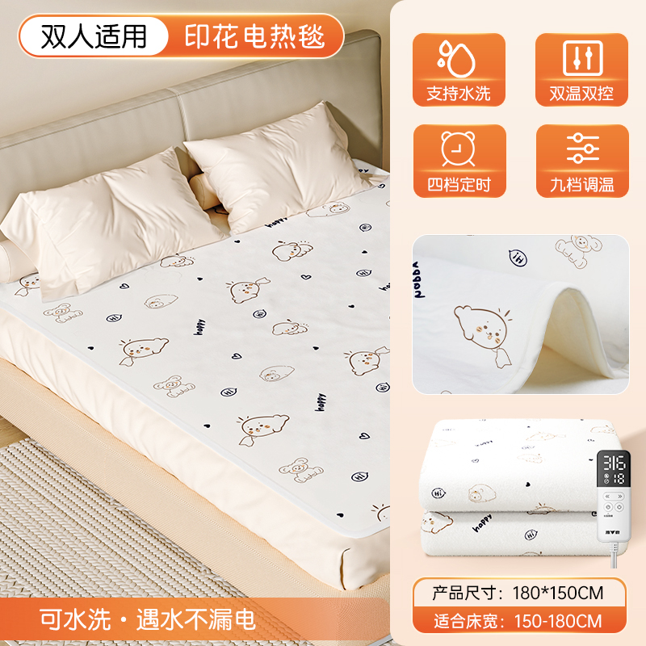

<ArticleMetadata />

## 一、产品图片



## 二、产品参数


::: warning 注意
150*70的插头不可拆卸，只能手洗
其他尺寸可以手洗，或者机洗
:::

::: code-group

```c# [150*70]
【产品型号】:T001-W-卡通印花 150*70
【定时】:无
【功率】:50w
【耗电】:10小时≈0.5度
【毛重】:1.1kg
【适合床】:躺椅
【档位数】:2档
【电源线长】:1.8M
【纸盒尺寸】:42*35*8cm
【温控方式】:单控
【除螨功能】:无
【档位温度】:35/55度
【产品清单】:毯子*1、说明书*1
【正反面料材质】:无纺布印花/无纺布纯色
```

```c# [180*120]
【产品型号】:T002-W-卡通印花 180*120
【定时】:1/2/5/8/10/12 小时
【功率】:90w
【耗电】:10小时≈0.9度
【净重】:1.41kg
【毛重】:2.05kg
【适合床】:单人床/宿舍床
【档位数】:9档
【电源线长】:1.8M
【纸盒尺寸】:50*42*12cm
【温控方式】:单控
【除螨功能】:有
【除螨温度】:55度 - 2 小时
【档位温度】:18/25/28/31/35/40/43/46/55度
【产品清单】:毯子*1、说明书*1
【正反面料材质】:无纺布印花/无纺布纯色
```

```c# [180*150]
【产品型号】:T003-W-卡通印花 180*150
【定时】:1/2/5/8/10/12 小时
【功率】:140w
【耗电】:10小时≈1.4度
【净重】:1.85kg
【毛重】:2.35kg
【适合床】:单人床/双人床
【档位数】:9档
【电源线长】:1.8M
【纸盒尺寸】:50*44*13cm
【温控方式】:单控
【除螨功能】:有
【除螨温度】:55度 - 2 小时
【档位温度】:18/25/28/31/35/40/43/46/55度
【产品清单】:毯子*1、说明书*1
【正反面料材质】:无纺布印花/无纺布纯色
```


```c# [200*180]
【产品型号】:T004-W-卡通印花 200*180
【定时】:1/2/5/8/10/12 小时
【功率】:170w
【耗电】:10小时≈1.7度
【净重】:2.38kg
【毛重】:2.79kg
【适合床】:双人床
【档位数】:9档
【电源线长】:1.8M
【纸盒尺寸】:55*52*13cm
【温控方式】:单控
【除螨功能】:有
【除螨温度】:55度 - 2 小时
【档位温度】:18/25/28/31/35/40/43/46/55度
【产品清单】:毯子*1、说明书*1
【正反面料材质】:无纺布印花/无纺布纯色
```

:::

## 三、面料优点
* 柔软性：无纺布可以根据需要调整其柔软度，适用于需要舒适触感的应用。
* 透气性：无纺布都具有良好的透气性能.
* 环保性：无纺布可以生物降解或回收利用，有助于减少环境影响.