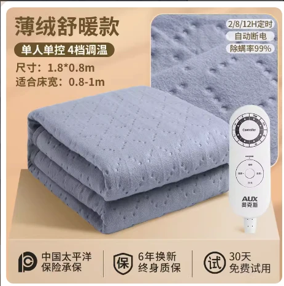

<!-- # 薄绒款基本参数

## 产品图片 -->

<!--  -->
<ArticleMetadata />
## 产品参数

::: code-group

```c# [150*70]
【产品型号】:
【定时】:2/4/8/12 小时
【功率】:50w
【耗电】:10小时≈0.5度
【适合床】:躺椅
【档位数】:9档
【电源线长】:1.8M
【温控方式】:单控
【除螨功能】:有
【除螨温度】:50度 - 2 小时
【档位温度】:10/15/20/25/30/35/40/45/50度
【产品清单】:毯子*1、说明书*1
【正反面料材质】:涤棉/无纺布
```

```c# [180*80]
【产品型号】:
【定时】:2/4/8/12 小时
【功率】:50w
【耗电】:10小时≈0.5度
【适合床】:单人床/宿舍床
【档位数】:9档
【电源线长】:1.8M
【温控方式】:单控
【除螨功能】:有
【除螨温度】:50度 - 2 小时
【档位温度】:10/15/20/25/30/35/40/45/50度
【产品清单】:毯子*1、说明书*1
【正反面料材质】:涤棉/无纺布
```

```c# [180*120]
【产品型号】:
【定时】:2/4/8/12 小时
【功率】:80w
【耗电】:10小时≈0.8度
【适合床】:单人床/宿舍床
【档位数】:9档
【电源线长】:1.8M
【温控方式】:单控
【除螨功能】:有
【除螨温度】:50度 - 2 小时
【档位温度】:10/15/20/25/30/35/40/45/50度
【产品清单】:毯子*1、说明书*1
【正反面料材质】:涤棉/无纺布
```

```c# [180*150]
【产品型号】:
【定时】:2/4/8/12 小时
【功率】:120w
【耗电】:10小时≈1.2度
【适合床】:单人床/双人床
【档位数】:9档
【电源线长】:1.8M
【温控方式】:单控
【除螨功能】:有
【除螨温度】:50度 - 2 小时
【档位温度】:10/15/20/25/30/35/40/45/50度
【产品清单】:毯子*1、说明书*1
【正反面料材质】:涤棉/无纺布
```

```c# [200*180]
【产品型号】:
【定时】:2/4/8/12 小时
【功率】:150w
【耗电】:10小时≈1.5度
【适合床】:单人床/双人床
【档位数】:9档
【电源线长】:1.8M
【温控方式】:单控
【除螨功能】:有
【除螨温度】:50度 - 2 小时
【档位温度】:10/15/20/25/30/35/40/45/50度
【产品清单】:毯子*1、说明书*1
【正反面料材质】:涤棉/无纺布
```

:::

## 优点
>1. 涤棉面料，柔软舒适，透气性好，保暖性极强。<br>
>2. 9档温度调节，满足不同温度需求。<br>
>3. 定时功能，可设置2/4/8/12小时定时关机。<br>
>4. 除螨功能，可设置50度 - 2 小时除螨。<br>

## 水暖毯优势

`水暖毯利用水填充式发热原理，温水密闭循环，代替电热毯，长期使用不口干，不上火，避免人体干燥缺水，对中老年人及儿童尤为适用，通过水进行导热，发热更均匀柔和，比传统的电热毯更利于人体健康。 `
