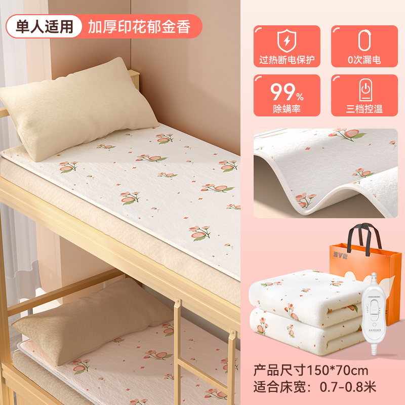

# 郁金香款
<ArticleMetadata />

## 一、产品图片


## 二、产品参数


> [!IMPORTANT]
> 注：此款没有降档功能/无默认12小时自动关机功能 <br>
> 如果不设置定时,会长期运行。


::: code-group

```c# [150*70]
【产品型号】:T014-郁金香 机械单控【150*70】
【定时】:无
【功率】:50w
【耗电】:10小时≈0.5度
【净重】:0.8kg
【毛重】:0.9kg
【适合床】:躺椅
【档位数】:2档
【电源线长】:1.8M
【纸盒尺寸】:40*37*8cm
【温控方式】:单控
【除螨功能】:无
【档位温度】:35/55度
【产品清单】:毯子*1、说明书*1
【正反面料材质】:无纺布印花/无纺布纯色
```

```c# [180*80]
【产品型号】:015-郁金香 定时单控【180*80】
【定时】:2/4/8/12 小时
【功率】:70w
【耗电】:10小时≈0.7度
【净重】:1kg
【毛重】:1.1kg
【适合床】:单人床/宿舍床
【档位数】:5档
【电源线长】:1.8M
【纸盒尺寸】:47*42*8cm
【温控方式】:单控
【除螨功能】:有
【除螨温度】:55度 - 2 小时
【档位温度】:35/40/45/50/55度
【产品清单】:毯子*1、说明书*1
【正反面料材质】:无纺布印花/无纺布纯色
```

```c# [180*120]
【产品型号】:T016-郁金香 定时单控【180*120】
【定时】:2/4/8/12 小时
【功率】:100w
【耗电】:10小时≈1度
【净重】:1.4kg
【毛重】:1.5kg
【适合床】:单人床/宿舍床
【档位数】:5档
【电源线长】:1.8M
【纸盒尺寸】:47*42*10cm
【温控方式】:单控
【除螨功能】:有
【除螨温度】:55度 - 2 小时
【档位温度】:35/40/45/50/55度
【产品清单】:毯子*1、说明书*1
【正反面料材质】:无纺布印花/无纺布纯色
```

```c# [180*150]
【产品型号】:T017-郁金香 定时双控【180*150】
【定时】:2/4/8/12 小时
【功率】:150w
【耗电】:10小时≈1.5度
【净重】:1.8kg
【毛重】:1.9kg
【适合床】:单人床/双人床
【档位数】:5档
【电源线长】:1.8M
【纸盒尺寸】:47*40*12cm
【温控方式】:双控
【除螨功能】:有
【除螨温度】:55度 - 2 小时
【档位温度】:35/40/45/50/55度
【产品清单】:毯子*1、说明书*1
【正反面料材质】:无纺布印花/无纺布纯色
```

```c# [200*180]
【产品型号】:T018-郁金香 定时双控【200*180】
【定时】:2/4/8/12 小时
【功率】:190w
【耗电】:10小时≈1.9度
【净重】:2.3kg
【毛重】:2.4kg
【适合床】:双人床
【档位数】:5档
【电源线长】:1.8M
【纸盒尺寸】:52*47*12cm
【温控方式】:双控
【除螨功能】:有
【除螨温度】:55度 - 2 小时
【档位温度】:35/40/45/50/55度
【产品清单】:毯子*1、说明书*1
【正反面料材质】:无纺布印花/无纺布纯色
```

:::

## 三、面料优点
* 柔软性：无纺布可以根据需要调整其柔软度，适用于需要舒适触感的应用。
* 透气性：无纺布都具有良好的透气性能.
* 环保性：无纺布可以生物降解或回收利用，有助于减少环境影响.